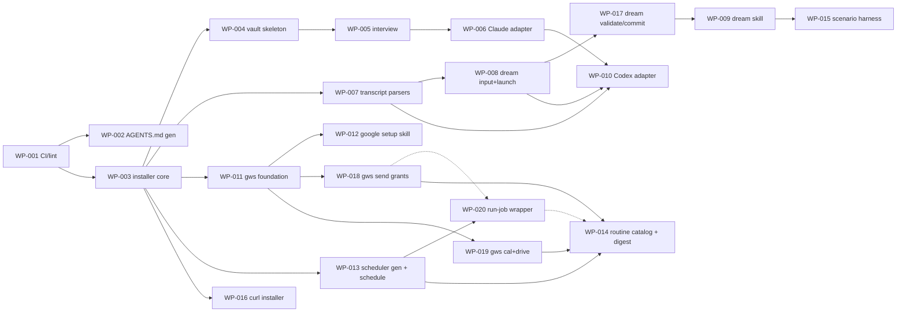

# Roadmap — milestones and work packages

Milestone acceptance criteria are binding; WPs are the unit of implementation. Status source of truth is each spec's frontmatter; this table is the index.

## Milestones

| M | Name | Acceptance (summary) |
|---|---|---|
| M0 | Foundation | Docs, ADRs, spec system, agents, dogfood scaffold exist (this commit). |
| M1 | Skeleton & installer | Clean-machine `npx wienerdog` creates `~/.wienerdog` + vault (git-initialized), detects harnesses; `uninstall --dry-run` lists exactly what was created; `doctor` passes. |
| M2 | Claude adapter + interview | `/wienerdog-setup` produces `06-Identity/*`; CLAUDE.md managed block rendered; new session demonstrably knows the user via injected digest; `sync` idempotent. *Go-public possible.* |
| M3 | Capture + dreaming | Fixture transcripts incl. planted injection → gated notes with provenance; injection never reaches Tier 3; one git commit per run; readable dream report; `git revert` cleanly undoes a run. |
| M4 | Codex adapter | Codex-only machine (no hooks) gets full setup + working dream from rollout files alone. |
| M5 | Google Workspace | Guided OAuth completes; gmail/cal/drive read+draft work headlessly from `claude -p`; sends execute only under a grant, ungranted sends degrade to draft+notice (ADR-0007); tokens 0600, survive reboot. |
| M6 | Scheduler + routine catalog | Native schedule entries on each OS; simulated hang → watchdog kill + alert; job missed by shutdown (dream included) runs within an hour of the machine being back; catalog flow (ADR-0008) configures digest incl. its send-to-self grant; digest arrives by email. |
| M7 | Hardening & release | Threat model finalized vs implementation; install→use→uninstall leaves only the vault; fresh-machine install from README alone; npm publish. |

## Work packages

| WP | Title | Milestone | Model | Status | Depends on |
|---|---|---|---|---|---|
| [WP-001](done/WP-001-ci-and-lint-pipeline.md) | CI and lint pipeline | M0/M1 | sonnet | Done | — |
| [WP-002](done/WP-002-agents-md-generator-and-schemas.md) | AGENTS.md generator + frontmatter schemas | M0/M1 | sonnet | Done | WP-001 |
| [WP-003](done/WP-003-installer-core.md) | Installer core (init/doctor/uninstall, manifest) | M1 | opus | Done | WP-001 |
| [WP-004](done/WP-004-vault-skeleton.md) | Vault skeleton generator + golden tests | M1 | sonnet | Done | WP-003 |
| [WP-005](done/WP-005-interview-skill-and-renderer.md) | Interview skill + identity→managed-block renderer | M2 | opus | Done | WP-004 |
| [WP-006](done/WP-006-claude-adapter.md) | Claude Code adapter (managed block, hooks, skills registration) | M2 | opus | Done | WP-005 |
| [WP-007](done/WP-007-transcript-parsers.md) | Transcript parsers (Claude JSONL + Codex rollout) | M3 | sonnet | Done | WP-003 |
| [WP-008](done/WP-008-dream-orchestrator.md) | Dream input assembly + brain launch (config, lock, watermarks, scratch, invocation) | M3 | opus | Done | WP-007 |
| [WP-009](WP-009-dream-skill.md) | Dream skill (phases, tiered gates, provenance) | M3 | opus | Ready | WP-008, WP-017 |
| [WP-010](WP-010-codex-adapter.md) | Codex CLI adapter (AGENTS.md block, hooks.json, skills discovery, codex-exec brain) | M4 | sonnet | Ready | WP-006, WP-007, WP-008 |
| [WP-011](WP-011-gws-foundation.md) | gws foundation (OAuth, client seam, Gmail read/draft) | M5 | opus | Ready | WP-003 |
| [WP-012](WP-012-google-setup-skill.md) | Google setup skill (guided OAuth) | M5 | sonnet | Ready | WP-011 |
| [WP-013](WP-013-scheduler-generators.md) | Scheduler generators + schedule command (launchd/systemd, reversible) | M6 | opus | Ready | WP-003 |
| [WP-014](WP-014-routine-catalog.md) | Routine catalog skill + daily-digest/inbox-triage/weekly-review | M6 | sonnet | Ready | WP-013, WP-018, WP-019 |
| [WP-015](WP-015-scenario-harness.md) | Scenario-test harness (nightly, incl. injection fixture) | M3/M7 | sonnet | Ready | WP-009 |
| [WP-016](done/WP-016-curl-installer-script.md) | curl installer bootstrapper (install.sh) | M1 | sonnet | Done | WP-003 |
| [WP-017](WP-017-dream-validate-commit.md) | Dream runtime pipeline (watchdog run, diff validation, single commit) | M3 | opus | Ready | WP-008 |
| [WP-018](WP-018-gws-send-grants.md) | gws send grants, Gmail send, _alert (ADR-0007) | M5 | opus | Ready | WP-011 |
| [WP-019](WP-019-gws-cal-drive.md) | gws Calendar + Drive read verbs | M5 | sonnet | Ready | WP-011 |
| [WP-020](WP-020-run-job-wrapper.md) | run-job wrapper (clean env, TCC-guard, watchdog, fail-loud, catch-up) | M6 | opus | Ready | WP-013, WP-018 |

## Dependency graph

</content>
