# Roadmap — milestones and work packages

Milestone acceptance criteria are binding; WPs are the unit of implementation. Status source of truth is each spec's frontmatter; this table is the index.

## Milestones

| M | Name | Acceptance (summary) |
|---|---|---|
| M0 | Foundation | Docs, ADRs, spec system, agents, dogfood scaffold exist (this commit). |
| M1 | Skeleton & installer | Clean-machine `npx wienerdog` creates `~/.wienerdog` + vault (git-initialized), detects harnesses; `uninstall --dry-run` lists exactly what was created; `doctor` passes. |
| M2 | Claude adapter + interview | `/wienerdog-setup` produces `06-Identity/*`; CLAUDE.md managed block rendered; new session demonstrably knows the user via injected digest; `sync` idempotent. *Go-public possible.* |
| M3 | Capture + dreaming | Fixture transcripts incl. planted injection → gated notes with provenance; injection never reaches Tier 3; one git commit per run; readable dream report; `git revert` cleanly undoes a run. |
| M4 | Codex adapter | Codex-only machine (no hooks) gets full setup + working dream from rollout files alone. |
| M5 | Google Workspace | Guided OAuth completes; gmail/cal/drive read+draft work headlessly from `claude -p`; sends execute only under a grant, ungranted sends degrade to draft+notice (ADR-0007); tokens 0600, survive reboot. |
| M6 | Scheduler + routine catalog | Native schedule entries on each OS; simulated hang → watchdog kill + alert; job missed by shutdown (dream included) runs within an hour of the machine being back; catalog flow (ADR-0008) configures digest incl. its send-to-self grant; digest arrives by email. |
| M7 | Hardening & release | Threat model finalized vs implementation; install→use→uninstall leaves only the vault; fresh-machine install from README alone; npm publish. |

## Work packages

| WP | Title | Milestone | Model | Status | Depends on |
|---|---|---|---|---|---|
| [WP-001](done/WP-001-ci-and-lint-pipeline.md) | CI and lint pipeline | M0/M1 | sonnet | Done | — |
| [WP-002](done/WP-002-agents-md-generator-and-schemas.md) | AGENTS.md generator + frontmatter schemas | M0/M1 | sonnet | Done | WP-001 |
| [WP-003](done/WP-003-installer-core.md) | Installer core (init/doctor/uninstall, manifest) | M1 | opus | Done | WP-001 |
| [WP-004](done/WP-004-vault-skeleton.md) | Vault skeleton generator + golden tests | M1 | sonnet | Done | WP-003 |
| [WP-005](done/WP-005-interview-skill-and-renderer.md) | Interview skill + identity→managed-block renderer | M2 | opus | Done | WP-004 |
| [WP-006](done/WP-006-claude-adapter.md) | Claude Code adapter (managed block, hooks, skills registration) | M2 | opus | Done | WP-005 |
| [WP-007](done/WP-007-transcript-parsers.md) | Transcript parsers (Claude JSONL + Codex rollout) | M3 | sonnet | Done | WP-003 |
| [WP-008](done/WP-008-dream-orchestrator.md) | Dream input assembly + brain launch (config, lock, watermarks, scratch, invocation) | M3 | opus | Done | WP-007 |
| [WP-009](done/WP-009-dream-skill.md) | Dream skill (phases, tiered gates, provenance) | M3 | opus | Done | WP-008, WP-017 |
| [WP-010](done/WP-010-codex-adapter.md) | Codex CLI adapter (AGENTS.md block, hooks.json, skills discovery, codex-exec brain) | M4 | sonnet | Done | WP-006, WP-007, WP-008 |
| [WP-011](done/WP-011-gws-foundation.md) | gws foundation (OAuth, client seam, Gmail read/draft) | M5 | opus | Done | WP-003 |
| [WP-012](done/WP-012-google-setup-skill.md) | Google setup skill (guided OAuth) | M5 | sonnet | Done | WP-011 |
| [WP-013](done/WP-013-scheduler-generators.md) | Scheduler generators + schedule command (launchd/systemd, reversible) | M6 | opus | Done | WP-003 |
| [WP-014](done/WP-014-routine-catalog.md) | Routine catalog skill + daily-digest/inbox-triage/weekly-review | M6 | sonnet | Done | WP-013, WP-018, WP-019 |
| [WP-015](done/WP-015-scenario-harness.md) | Scenario-test harness (nightly, incl. injection fixture) | M3/M7 | sonnet | Done | WP-009 |
| [WP-016](done/WP-016-curl-installer-script.md) | curl installer bootstrapper (install.sh) | M1 | sonnet | Done | WP-003 |
| [WP-017](done/WP-017-dream-validate-commit.md) | Dream runtime pipeline (watchdog run, diff validation, single commit) | M3 | opus | Done | WP-008 |
| [WP-018](done/WP-018-gws-send-grants.md) | gws send grants, Gmail send, _alert (ADR-0007) | M5 | opus | Done | WP-011 |
| [WP-019](done/WP-019-gws-cal-drive.md) | gws Calendar + Drive read verbs | M5 | sonnet | Done | WP-011 |
| [WP-020](done/WP-020-run-job-wrapper.md) | run-job wrapper (clean env, TCC-guard, watchdog, fail-loud, catch-up) | M6 | opus | Done | WP-013, WP-018 |
| [WP-021](done/WP-021-gws-dispatch-reconciliation.md) | Reconcile gws dispatch with verb-module contracts | M5 | sonnet | Done | WP-018, WP-019 |
| [WP-023](done/WP-023-scenario-subscription-auth.md) | Scenario harness on subscription auth (decouple fixture isolation from auth) | M3/M7 | sonnet | Done | WP-015, WP-020 |
| [WP-022](done/WP-022-vault-layout-layer.md) | Vault layout config layer + layout-aware digest render | M3 | opus | Done | — |
| [WP-024](done/WP-024-layout-aware-dream.md) | Layout-aware dream write path (validate tiers, brain prompt, skill) | M3 | opus | Done | WP-022 |
| [WP-025](done/WP-025-guided-import.md) | Guided import from an existing vault (setup skill step 3) | M2 | sonnet | Done | WP-022 |
| [WP-026](done/WP-026-full-adoption-flow.md) | Full vault adoption — `wienerdog adopt` CLI, prerequisites, layout mapping | M2/M3 | opus | Done | WP-024, WP-025 |
| [WP-027](done/WP-027-defer-vault-creation.md) | Defer vault creation until the vault path is chosen (init `--fresh-vault`) | M2/M3 | opus | Done | WP-026 |
| [WP-028](done/WP-028-bootstrap-skill-registration.md) | Register skills + hooks on bootstrap (sync vault-independent; init runs sync) | M2 | opus | Done | WP-027 |
| [WP-029](done/WP-029-adopt-snapshot-robustness.md) | Harden `adopt` initial-snapshot (surfaced git errors, stale-lock recovery, starter .gitignore) | M2/M3 | opus | Done | WP-026 |
| [WP-030](done/WP-030-digest-h1-and-adopt-invocation.md) | Digest: drop note's leading H1; setup skill shows both adopt invocation forms | M2/M3 | sonnet | Done | WP-022 |
| [WP-031](done/WP-031-install-consent-engine.md) | install.sh dependency-consent engine (detection, tty gate, sudo probe, consent harness) | M1/M7 | opus | Done | WP-016 |
| [WP-032](done/WP-032-macos-autoinstall-actions.md) | macOS consented auto-install (CLT git; official .pkg / brew Node) | M1/M7 | opus | Done | WP-031 |
| [WP-033](done/WP-033-linux-autoinstall-actions.md) | Linux consented auto-install (PM install + ≥18 verify; NodeSource fallback) | M1/M7 | opus | Done | WP-031, WP-032 |
| [WP-034](done/WP-034-tty-prompts-for-cli.md) | /dev/tty prompts for piped CLI confirmations | M7 | sonnet | Done | WP-031 |
| [WP-035](done/WP-035-ci-linux-test-portability.md) | Linux CI test portability (usr-merge, git identity) | M7 | sonnet | Done | WP-033 |
| [WP-036](done/WP-036-linux-resolve-bin-hermeticity.md) | Hermetic resolve_bin isolation (Linux CI) | M7 | opus | Done | WP-035 |
| [WP-037](done/WP-037-macos-runner-hermeticity.md) | Hermetic resolve_bin isolation (macOS CI) | M7 | opus | Done | WP-036 |
| [WP-038](done/WP-038-runjob-production-hardening.md) | run-job hardening: clean-env PATH/USER, evidence-preserving log rotation, brain stderr tail | M7 | opus | Done | WP-020 |
| [WP-039](done/WP-039-dream-precommit-crash-recovery.md) | Dream pre-commit of session edits + crashed-brain vault recovery | M7 | opus | Done | WP-017, WP-038 |
| [WP-040](done/WP-040-dream-note-update-provenance.md) | Dream skill preserves provenance when updating an existing note | M7 | sonnet | Done | WP-009 |
| [WP-041](done/WP-041-persistent-failure-alerts.md) | Persistent failure alerts (alerts.jsonl) rendered into the digest | M7 | opus | Done | WP-039 |
| [WP-042](done/WP-042-vendored-install.md) | Vendor the package into the core; schedules target a stable app/current entry | M7 | opus | Done | — |
| [WP-043](done/WP-043-sync-repoints-schedules.md) | sync repoints existing schedules to the vendored entry (migration) | M7 | opus | Done | WP-042 |
| [WP-044](done/WP-044-dream-scheduled-by-default.md) | Schedule the nightly dream by default when a vault is created | M7 | opus | Done | WP-043 |
| [WP-045](done/WP-045-update-check-core.md) | Update-availability check — core module + config opt-out | M7 | sonnet | Done | WP-044 |
| [WP-046](done/WP-046-update-check-wiring.md) | Wire the update check into run-job + render in digest/doctor; threat model | M7 | opus | Done | WP-045 |
| [WP-047](done/WP-047-gws-ondemand-googleapis.md) | On-demand googleapis in a core deps dir; gws require-seam + clean setup error | M7 | opus | Done | WP-042 |
| [WP-048](done/WP-048-dream-input-capacity-starvation.md) | Fix dream input-capacity starvation (truncate-to-fit + loud capacity alert) | M7 | opus | Done | WP-039, WP-041 |
| [WP-049](done/WP-049-repoint-current-windows-fallback.md) | Windows-safe repointCurrent fallback + orphan current.tmp.* cleanup | M7 | sonnet | Done | WP-042 |
| [WP-050](done/WP-050-skills-copy-fallback.md) | Skills copy-fallback where symlink creation is unpermitted (Windows) | M7 | opus | Done | WP-006 |
| [WP-051](done/WP-051-repoint-noop-and-windows-cmd-shim.md) | repointCurrent same-target no-op + Windows-usable .cmd shim | M7 | sonnet | Done | WP-042, WP-049 |
| [WP-052](done/WP-052-agent-driven-install-ux.md) | Agent-driven install UX — plan-then-install prompt, package trust, restart note | M1/M7 | sonnet | Done | — |
| [WP-053](done/WP-053-tarball-fetch-verify-unpack.md) | Registry-tarball fetch, sha512 verify, unpack into vendored layout | M7 | opus | Done | — |
| [WP-054](done/WP-054-update-verb-and-notice-switch.md) | `wienerdog update` verb + npx-aware update-notice command switch | M7 | opus | Done | WP-053 |
| [WP-055](done/WP-055-install-sh-tarball-fallback.md) | install.sh npm-less tarball fallback (consented curl+verify+tar → node init) | M1/M7 | opus | Done | WP-054 |
| [WP-056](done/WP-056-windows-install-research-spike.md) | Windows install.ps1 platform research spike (consent surface, Node elevation, CI) | M7 | opus | Done | — |
| [WP-057](done/WP-057-install-ps1-core.md) | install.ps1 core — detection, consent, npm-less tarball fallback, CI lint+Pester gate | M7 | opus | Done | WP-056 |
| [WP-058](done/WP-058-install-ps1-node-git-actions.md) | install.ps1 Node/git auto-install (winget → signed MSI + UAC), PATH refresh, manual Windows verification | M7 | opus | Done | WP-057 |
| [WP-059](done/WP-059-watchdog-pidfile-race.md) | Close the watchdog-test pidfile race (bounded poll before asserting the kill) | M7 | sonnet | Done | — |
| [WP-060](done/WP-060-init-proceed-default-yes.md) | init "Proceed?" defaults to yes (per-call defaultYes in shared confirm) | M7 | sonnet | Done | — |
| [WP-061](done/WP-061-install-ps1-completion-banner.md) | install.ps1 stays open with a completion banner (iex-safe return-not-exit) | M7 | opus | Done | — |
| [WP-062](done/WP-062-runjob-windows-clean-env-and-watchdog.md) | run-job Windows reliability — win32 clean env + taskkill watchdog kill-tree | M6 | opus | Done | — |
| [WP-063](done/WP-063-windows-task-scheduler-generators.md) | Windows Task Scheduler XML generators (pure renderers + helpers) | M6 | opus | Done | — |
| [WP-064](done/WP-064-schedule-win32-dispatch-and-manual-verify.md) | schedule.js win32 dispatch — register dream + catch-up via schtasks; owner VPS verify | M6 | opus | Done | WP-062, WP-063 |
| [WP-065](done/WP-065-setup-structured-questions.md) | Structured closed-choice interview questions + dream reassurance in setup skill | M7 | sonnet | Done | — |
| [WP-066](done/WP-066-dream-schedule-catchup-reassurance.md) | Dream catch-up reassurance across CLI summaries + README | M7 | sonnet | Done | — |
| [WP-067](done/WP-067-cmd-shim-single-parser-block.md) | Windows .cmd shim single-parser-block (survive self-deletion on uninstall) | M7 | sonnet | Done | — |
| [WP-068](done/WP-068-uninstall-vault-preserve-and-core-disposal.md) | Uninstall vault-preserve handler + machine-generated core disposal | M7 | opus | Done | — |
| [WP-069](done/WP-069-dream-concurrency-watermark-safety.md) | Dream concurrency + watermark-consolidation safety (lock-first scratch, no-op loser, consumed-only watermark) | M7 | opus | Done | WP-048 |
| [WP-070](done/WP-070-scheduler-load-health-check.md) | Scheduler-load health check — doctor + digest surface "configured but not loaded"; sync heals | M7 | opus | Done | — |
| [WP-071](done/WP-071-test-guard-real-scheduler.md) | Hard test guard against real scheduler mutation (per-user-global labels) | M7 | opus | Done | WP-070 |
| [WP-072](done/WP-072-install-ps1-noninteractive-init-handoff.md) | install.ps1 hands off to init non-interactively (fix Windows irm\|iex hang) | M7 | opus | Done | — |
| [WP-073](done/WP-073-vendor-junction-repoint.md) | repointCurrent uses a junction on Windows (unprivileged install no longer EPERM-crashes) | M7 | sonnet | Done | — |
| [WP-074](done/WP-074-windows-task-xml-utf16-drop-logontrigger.md) | Windows task XML UTF-16 LE + drop unprivileged LogonTrigger | M6 | opus | Done | — |
| [WP-075](done/WP-075-scheduler-fail-loud-on-load-failure.md) | Fail loud when a scheduler mutation is rejected (no false scheduled/reloaded) | M6/M7 | opus | Done | WP-074 |
| [WP-076](done/WP-076-runjob-win32-git-on-clean-path.md) | win32 clean-env PATH includes git (nightly dream no longer ENOENTs) — ship-blocker | M6/M7 | sonnet | Done | — |
| [WP-077](done/WP-077-hook-commands-forward-slash-on-win32.md) | Register hook commands with forward-slash paths (Windows SessionEnd no longer ENOENTs) | M7 | opus | Done | — |
| [WP-078](done/WP-078-codex-skills-in-codex-home.md) | Link Codex skills into $CODEX_HOME/skills (0.144.x discovery root), not ~/.agents/skills | M4 | sonnet | Done | — |
| [WP-079](done/WP-079-doctor-codex-skill-links.md) | doctor check — Codex skill links exist under $CODEX_HOME/skills when Codex detected | M4 | sonnet | Done | WP-078 |
| [WP-080](done/WP-080-transcript-skill-invocation-signal.md) | Transcript extracts retain a skill-invocation signal (Claude parser) | M3 | sonnet | Done | — |
| [WP-081](done/WP-081-dream-skill-learnings.md) | Dream accumulates per-skill learnings in a validated quarantined ledger | M3 | opus | Done | WP-080, WP-083 |
| [WP-082](done/WP-082-recurrence-gated-skill-revision.md) | Recurrence-gated skill-body revision with registry-scoped code backstop | M3 | opus | Done | WP-081, WP-083, WP-084 |
| [WP-083](done/WP-083-skill-ownership-registry.md) | Skill ownership registry — tamper-proof write-origin marker for dream-created skills | M3 | opus | Done | — |
| [WP-084](done/WP-084-ledger-evidence-trust-derivation.md) | Bind ledger learnings to skill invocations — window-based mechanical trust | M3 | opus | Done | WP-080, WP-081, WP-083 |
| [WP-085](WP-085-gws-mime-crlf-sanitization.md) | Reject CR/LF in Gmail MIME header fields (close the send-grant header-injection bypass) | M7 | sonnet | Done | — |
| [WP-086](WP-086-send-grant-boundary-hardening.md) | Harden the send-grant boundary — require a terminal to mint a grant; fail closed on empty recipients | M7 | sonnet | Done | — |
| [WP-087](WP-087-dream-truncation-index-rebase.md) | Rebase skill-invocation indices under byte-budget truncation | M3 | sonnet | Done | — |
| [WP-088](WP-088-manifest-reverse-crash-safety.md) | Uninstall crash-safety — defer the deferred-deletion set (manifest, core, config.yaml) until the sweep succeeds; hash-guard file deletes; contain tree removal (delete copied skill only if it fingerprints to the recorded hash) | M7 | opus | Done | WP-089 |
| [WP-089](WP-089-adapter-skill-dir-ownership.md) | Adapter skill-dir ownership — fingerprint-guard skill-dir refresh instead of blind rmSync | M7 | sonnet | Done | — |
| [WP-090](WP-090-hook-command-shell-quoting.md) | Shell-quote hook command paths (space/metachar install paths produce valid hooks) | M7 | opus | Done | WP-089 |
| [WP-091](WP-091-managed-block-line-anchoring.md) | Anchor managed-block sentinels to full lines; fail closed on ambiguous markers | M7 | opus | Done | WP-088, WP-090 |
| [WP-092](WP-092-init-secrets-chmod-guard.md) | init only chmods the secrets dir it created (never a pre-existing user path) | M7 | sonnet | Done | — |
| [WP-093](WP-093-tarball-extraction-containment.md) | Tarball install hardening — secure temp, member-name preflight, completeness marker | M7 | opus | Done | — |
| [WP-094](WP-094-install-sh-network-hardening.md) | install.sh network hardening — pin curl to HTTPS, exact Node URL before consent, gate TTY seam | M7 | opus | Done | — |
| [WP-095](WP-095-tccguard-realpath-resolution.md) | Realpath-resolve the vault before the TCC guard (symlinked-vault hang) | M7 | sonnet | Done | — |
| [WP-096](WP-096-alerts-bounded-schema-capped.md) | Bound alerts.jsonl growth and cap alert field sizes | M7 | sonnet | Done | — |
| [WP-097](WP-097-scheduler-generator-path-escaping.md) | XML-escape launchd plist values and quote systemd ExecStart paths | M7 | sonnet | Done | — |
| [WP-098](WP-098-scheduler-secondary-call-fail-loud.md) | Surface best-effort systemd-call failures; report schedule-removal truthfully | M7 | sonnet | Done | — |
| [WP-099](WP-099-install-ps1-git-url-validation.md) | Validate the Git-for-Windows asset URL is HTTPS on a GitHub host before download | M7 | sonnet | Done | — |
| [WP-100](WP-100-codex-tool-output-and-fail-closed-roles.md) | Codex transcript parser — recognize the current tool-output item type (`custom_tool_call_output` + variants) and fail closed on unknown roles | M7 | sonnet | Done | — |
| [WP-101](WP-101-gws-oauth-state-pkce.md) | gws OAuth loopback — add `state` + PKCE (RFC 8252) | M7 | sonnet | Done | — |
| [WP-102](WP-102-gws-deps-self-heal.md) | gws read-path self-heal + disambiguated deps error (fix the post-upgrade dead-end) | M5/M7 | sonnet | In-Review | — |
| [WP-103](WP-103-doctor-gws-deps-probe.md) | doctor probe — connected Google account with a missing/broken client library | M5/M7 | sonnet | In-Review | WP-102 |
| [WP-104](WP-104-gws-drive-search-friendly-query.md) | gws drive search — friendly term search by default, `--raw` for Drive query language | M5 | sonnet | Ready | — |
| [WP-105](WP-105-sync-interactive-gws-backfill.md) | sync interactive backfill of the on-demand googleapis install (headless-only users) | M5/M7 | sonnet | In-Review | WP-102 |

> **First-production-night incident (2026-07-04).** WP-038, WP-039 and WP-041 form
> a serial chain (they edit the shared `run-job.js` / `dream.js` / `validate.js`
> cluster); WP-040 branches off the dream skill independently. Together they close
> the six gaps the first scheduled dream exposed: clean-env PATH/USER (WP-038),
> log-rotation evidence loss (WP-038), brain-stderr surfacing (WP-038 captures +
> WP-039 surfaces), dirty-vault starvation and crashed-brain self-starvation
> (WP-039), transient failure visibility (WP-041), and note-update provenance loss
> (WP-040).

<!-- -->

> **Vendored-install + default-dream + update-check chain (2026-07-04).** WP-042→046
> form a serial chain implementing three owner decisions (ADR-0013/0014/0015).
> WP-042 vendors the package into `~/.wienerdog/app/<version>/` behind a stable
> `app/current` symlink so scheduler entries stop pointing at the ephemeral npx
> cache, AND writes a `~/.local/bin/wienerdog` shim (bare `wienerdog` resolved
> nowhere on real installs — a pre-existing P1 that broke every gws routine).
> WP-043 migrates the two live installs' existing schedules onto that stable path
> (via `sync`, the canonical update command). WP-044 then schedules
> the nightly dream by default the moment a vault is created (silent, 03:30),
> which also seeds the update-check cache each night. WP-045 builds the bounded,
> opt-out, semver-validated update-check module; WP-046 wires its refresh into
> `run-job` and renders the cached notice into the digest + `doctor`, and adds
> THREAT-MODEL T7 plus the deferred `alerts.jsonl` injection-surface note. The
> chain is linear because these WPs share `sync.js`, `schedule.js`, `init.js`,
> `run-job.js`, and `digest.js`; serializing them avoids merge conflicts and lets
> each build on the prior contract. **WP-047** branches off WP-042 (it needs the
> vendored `app/` dir + shim): it installs `googleapis` on demand — with consent,
> once — into `~/.wienerdog/app/deps/` and routes the gws require through a deps-dir
> seam with a plain "run /wienerdog-google-setup" error, so gws works from the
> node_modules-free vendored copy. It shares no files with WP-043→046 and can land
> in parallel after WP-042.

<!-- -->

> **Second silent-starvation incident (2026-07-05).** The 03:30 dream reported
> "nothing new to dream" (exit 0) while four fresh Claude sessions existed past
> the watermark: each extract alone exceeded the 400 000-byte input budget, the
> newest-first size loop `break`s at the first over-budget session (dropping the
> smaller ones behind it), and `entries.length === 0` masqueraded as success — so
> no watermark advanced, no report was written, and the WP-041 durable-alert path
> (which only fires on a *failing* dream) stayed unreachable. Heavy Claude days
> starved the dream permanently and invisibly. **WP-048** closes it: raise the
> default `dream_max_input_bytes` to 8 000 000; replace the break loop with
> water-filling that **truncates boundary sessions to fit** (keep newest messages,
> per-session floor 32 768 B) instead of dropping them whole — guaranteeing the
> newest session is always fed and the watermark always advances; and make a
> wedged (nothing-fed) dream **throw** rather than report "nothing new", so
> `run-job`'s fail-loud records a durable `alerts.jsonl` entry the digest surfaces.
> Extends ADR-0012 (parts 4–5).

<!-- -->

> **Windows degraded-install defects (2026-07-05).** A high-quality external
> report (Windows Server 2022, Node 24, published v0.3.0) surfaced two hard gaps
> in an unconditional code path: (1) `wienerdog sync`/`init` crash with `EPERM`
> in `repointCurrent` because `fs.renameSync` over an **existing** directory
> symlink is not permitted on Win32 — the POSIX-atomic-rename assumption ADR-0013
> made — so every run after the first aborts before writing the digest and
> orphans a `current.tmp.<pid>` link; and (2) skills are never linked into
> `~/.claude/skills/` (symlink creation unpermitted), so the `/wienerdog-*`
> commands never register. Windows scheduling/`install.ps1` stay deferred to
> M6–M7, but a published crash is a defect regardless of support tier. **WP-049**
> (independent, `src/core/vendor.js`) adds a remove-then-rename fallback on
> `EPERM`/`EEXIST`/`ENOTEMPTY` plus an orphan-tmp sweep (brief non-atomic window
> accepted under the module's single-writer assumption; recorded as a dated
> ADR-0013 amendment). **WP-050** (independent, `src/adapters/shared.js` +
> `src/core/manifest.js`) copies each `wienerdog-*` skill folder where symlinks
> are unpermitted, behind a new reversible `copied-skill` manifest kind. Both are
> testable on POSIX via injected `rename`/`symlink` seams (no `process.platform`
> mocking) and can land in parallel — they share no files with each other or with
> WP-048.

<!-- -->

> **Windows agent-driven-install follow-ups (2026-07-05).** After WP-049/050 fixed
> the two headline Windows crashes, the same from-scratch report (Windows Server
> 2022, Claude Code driving `npx wienerdog@latest init`) surfaced three further
> items. **WP-051** (independent of WP-050, on `src/core/vendor.js`) closes two
> defects on unconditional code paths: (1) `repointCurrent` rewrote the `current`
> symlink on *every* sync even when it already pointed at the target — needlessly
> exercising the WP-049 remove-then-rename fallback, which can self-lock on
> Windows because the invoking `node` runs from inside `app/current` and holds the
> reparse point; it now no-ops when `current` is already correct (path.resolve
> compare) while still sweeping orphans; and (2) the bash `~/.local/bin/wienerdog`
> shim is unusable by cmd.exe/PowerShell, so `writeShim` now additionally writes a
> `wienerdog.cmd` on win32 (manifest-tracked `kind:'file'`, byte-idempotent, CRLF).
> Both are POSIX-testable via the existing `opts.rename` seam and a new
> `opts.platform` seam — no `process.platform` mocking. **WP-052** (docs/skill
> only, independent) fixes the agent-driven install *instructions*: the README
> paste-in prompt now tells the driving AI to show the plan (`init --dry-run`)
> before installing (`init --yes`) — the human-in-chat is the consent surface —
> hands it the repo + npm URLs so a cautious agent can verify the package, and
> tells the user to restart the harness so the `/wienerdog-*` commands load;
> `init`'s own prompting is unchanged. The two WPs share no files and can land in
> parallel.

<!-- -->

> **0.4.0 npm-less distribution chain (2026-07-05).** Live 0.3.x testing found
> users with Node ≥ 18 but no `npx`/`npm`. Since Wienerdog has zero runtime deps,
> the published npm tarball IS the whole app, and ADR-0013's vendored layout
> (`~/.wienerdog/app/<version>/` behind `app/current`) is literally "unpack a
> tarball here." **ADR-0016** adds an npm-independent install/update channel that
> fetches the registry tarball over HTTPS, verifies its **sha512** SRI integrity
> before unpacking, and lands it in the vendored layout; npm/npx stays the happy
> path where present. **WP-053** builds the reusable core module
> (`src/core/tarball.js`: fetch `/wienerdog/latest` manifest → validate → download
> → verify sha512 → `tar --strip-components=1` into `app/<v>/`, atomic staging,
> idempotent, no manifest write — the `vendored-tree` entry already covers it).
> **WP-054** adds the `wienerdog update` CLI verb (fetch+verify+unpack, then hand
> off to the **new version's** `sync` so it re-vendors + repoints `current` — never
> the in-process/old sync, or the update silently reverts) and switches ADR-0015's
> "update available" notice to quote `wienerdog update` when `npx` is absent and
> `npx wienerdog@latest sync` when present (pure spawn-free PATH scan at render
> time). **WP-055** gives `install.sh` a consented tarball fallback (ADR-0011
> posture: show what/where, `/dev/tty` prompt, fail-to-print) when Node is present
> but `npx` is not: `curl` the tarball, verify sha512 with the guaranteed-present
> `node`, `tar` into `app/<v>/`, `exec node .../init` (extract-into-final-dir means
> `vendorSelf` sees the version dir exists and skips the copy — no double copy).
> Serial chain (shared ADR + ROADMAP rows; avoids merge conflicts). No auto-update
> invariant (ADR-0004/0015) unchanged: `update` runs only on explicit command; the
> notice only tells. `googleapis` stays npm-only (ADR-0016 §6 — documented, a
> wd-docs follow-up on the google-setup message; no npm-less googleapis path).
> `install.ps1`/Windows bootstrap remains out of scope.

<!-- -->

> **Windows bootstrap `install.ps1` chain (2026-07-05, ADR-0017).** Pulls the
> promised PowerShell installer (ADR-0006) forward from M6–M7: `irm <url>/install.ps1
> | iex` gets a bare Windows Server 2022 / Windows 11 machine to a working
> `wienerdog init` + skills under `install.sh`'s ADR-0011 trust posture.
> **WP-056** is a wd-researcher spike (memo
> `memory/research/2026-07-05-windows-install-ps1.md`) that resolved the two
> load-bearing unknowns rather than guess them: (a) `irm|iex` is PowerShell's
> *object* pipeline, so the interactive console stays usable for per-hop
> `Read-Host` consent — no bash-style `curl|bash` stdin trap; and (b) **Node's
> official MSI is `ALLUSERS=1` per-machine-only and hard-requires UAC — there is no
> non-elevated official Node install**, the decisive elevation fork. It also
> confirmed `ubuntu-latest`/`macos-latest` runners ship `pwsh`+Pester+PSScriptAnalyzer,
> so the PowerShell script is CI-lintable and pure-function-testable with zero extra
> runner cost. **WP-057** (Ready) builds the testable core — the `$NonInteractive`
> detector, `Read-Host` `Confirm-Step` consent, the npm-less registry-tarball
> fallback (ADR-0016 analog of WP-055, with a fully-anchored semver gate), the `npx`
> handoff, PSScriptAnalyzer settings + Pester harness + CI wiring — a complete,
> CI-verified installer for **Node-present** Windows machines; its `Main` prints and
> exits when Node is missing (placeholder). **WP-058** (In-Review) fills that branch
> with the consented Node/git auto-install: winget-if-present, else the official signed
> MSI downloaded + SHA256-verified + installed via a UAC elevation (`Start-Process
> -Verb RunAs`), plus registry PATH refresh — and carries the **mandatory manual
> Windows VM checklist** (CI has no Windows runner). Its elevation posture is confirmed
> (ADR-0017 Accepted, 2026-07-05); CI covers the pure helpers plus the
> SHA-mismatch/elevation-failure *handling* via mocked seams, with the real
> UAC/MSI/registry paths on the manual checklist. Windows scheduling / `schtasks` stays deferred; the dream
> is not scheduled on Windows yet (digest/skills/manual dream still work).

<!-- -->

> **Windows-VPS post-install UX (2026-07-06).** The owner's real Windows Server
> 2022 `irm .../install.ps1 | iex` install worked end-to-end (Node MSI, UAC accept,
> PATH refresh, handoff to `npx wienerdog@latest init`) and surfaced two
> post-install UX asks. **WP-060** (JS, independent) flips `init`'s
> plan-confirmation to default-yes: the shared `confirm()` in `src/core/prompt.js`
> gains a **per-call** `{defaultYes}` opt (default false — every existing caller,
> incl. `uninstall`'s destructive `Proceed with removal?`, byte-for-byte
> unchanged), and ONLY `init`'s "Proceed?" passes `{defaultYes:true}` + `[Y/n]`.
> The default-yes is scoped to the interactive empty-Enter case only: EOF /
> no-terminal (mode 3) still abort loudly, and `--yes` still bypasses — aligning
> init with ADR-0011's `[Y/n]`-default-yes install-hop norm. `adopt`'s four prompts
> are untouched: it uses its OWN local `confirm`, not `src/core/prompt`. **WP-061**
> (PowerShell, independent) makes `install.ps1` survive `iex`: under `irm|iex` the
> script runs inside the user's live host, so `Main`'s `exit` closed the window the
> instant the install succeeded. `Main` now **returns** an exit code (never
> `exit`), prints a plain completion banner on success, and the dot-source guard
> `exit`s only for a real script file (`InvocationName` non-empty) while setting
> `$global:LASTEXITCODE` + returning under `iex` (`''`). Frozen as an ADR-0017
> amendment (iex-safe exit discipline); the no-exit/banner logic is CI-covered by
> Pester `Main` tests (a returning `Main` proves it did not `exit`). The two WPs
> share no files and carry no dependency — they can land in parallel.

<!-- -->

> **Windows scheduled dreaming chain (2026-07-06, ADR-0018).** Closes the last
> platform gap: a Windows install now auto-schedules the nightly dream at 03:30
> at vault creation (ADR-0014, which had carved Windows out as "unsupported"),
> with laptop-off / logged-off catch-up, watchdog/fail-loud, `schedule`
> add/remove/list parity, manifest-tracked reversibility, IRON RULE intact
> (OS-native Task Scheduler tasks, no daemon). The research spike
> (`memory/research/2026-07-06-windows-scheduled-dreaming.md`) resolved the
> load-bearing facts from primary sources: a standard user registers a per-user
> task with **no elevation** via `schtasks /create … /it` at the default
> `/rl LIMITED`; **`StartWhenAvailable` is XML-only**, so registration uses
> `schtasks /create /tn <name> /xml <file> /f` (an XML *renderer*, the
> launchd/systemd analog); an interactive per-user task does not run while logged
> off, so an **ONLOGON + hourly catch-up task** is required exactly as on macOS;
> `paths.js` is **already Windows-safe** (`env.HOME || os.homedir()`) so the
> feared HOME-fix WP does not exist; and the watchdog's negative-PID
> process-group kill is **POSIX-only** (Windows needs `taskkill /T /F`). Two
> Task-Scheduler XML settings default to `true` and would silently skip/kill the
> dream on an unplugged laptop — the generator forces
> `DisallowStartIfOnBatteries`/`StopIfGoingOnBatteries` to `false`. **WP-062**
> (independent, `run-job.js`) adds the two reliability-critical win32 branches —
> Windows-shaped clean env (`;`-PATH + `USERPROFILE`/`APPDATA`/… so the dream
> brain is findable + credential-bearing) and `taskkill /T /F` tree-kill — the
> Windows twin of the launchd USER/PATH incident; both testable on POSIX via an
> injected `platform` + kill/spawn seams (never `process.platform` mocking).
> **WP-063** (independent, `generators.js`) adds the pure XML renderers
> (`windowsDreamTaskXml`, `windowsCatchupTaskXml`) + name/path/escape helpers,
> fully golden-testable in CI. **WP-064** (the capstone, `schedule.js`, depends
> on both) adds the `registerPlatform` win32 branch (write XML via `ensureEntry`,
> register via the injected loader, `WIENERDOG_LOADER_NOOP` honored), the Windows
> catch-up ensure, the `remove()` basename, and a `platform` test seam so the
> whole dispatch is CI-covered on POSIX — plus a **mandatory owner Windows-VPS
> checklist** (no Windows CI runner; the physical UAC-free registration,
> missed-run catch-up, live dream, and uninstall cleanliness gate merge, WP-058
> precedent). `manifest.js` needs no change (reversal is already generic);
> `init`/`adopt` already reach `ensureDreamSchedule`, which stops degrading
> Windows once the branch exists. Serial only where they share files: WP-062 and
> WP-063 land in parallel; WP-064 after both.

<!-- -->

> **Post-setup UX polish (2026-07-06, two parallel S WPs).** A full
> `/wienerdog-setup` on Windows produced two platform-agnostic UX asks. **WP-065**
> (setup skill only) makes the interview's closed-choice items — the Step 0
> adjust-menu, preferred tone, the fresh/import/adopt vault choice, and memory
> eagerness — ask via a **structured multiple-choice question where the harness
> provides one** (Claude Code's `AskUserQuestion`) and via a plain **numbered
> list where it does not** (Codex CLI), with the binding invariant that the user
> can always type a custom answer (Claude Code's `AskUserQuestion` supplies the
> free-text "Other" automatically). Genuinely open items (role, projects, tools,
> goals, standing rules) stay free-text — exactly four `(closed-choice)` markers,
> no over-structuring. **WP-066** adds a frozen one-sentence **dream catch-up
> reassurance** to every surface that discloses the 03:30 schedule — `init.js`
> and `adopt.js` summaries and the README Dreaming bullet — so users never think
> they must leave the machine on overnight; it *extends* ADR-0014's plain
> disclosure (the 03:30 time still stated), it does not weaken it. The two WPs
> share **no files** (WP-065 owns `skills/wienerdog-setup/SKILL.md` outright,
> including that skill's copy of the reassurance, so the CLI/README changes in
> WP-066 never collide with it) and carry no dependency — they land in parallel.
> Neither needs a new ADR: the reassurance surfaces a behavior ADR-0014 already
> guarantees (WP-020 catch-up), and vendor-neutral graceful degradation is a
> local skill-authoring choice.

<!-- -->

> **Windows uninstall field report (2026-07-06, credit: real Windows Server 2022
> v0.6.0 uninstall via the `wienerdog.cmd` shim).** The vault-preservation itself
> is by design (M7: "install → use → uninstall leaves only the vault") and is
> never weakened here — but three mechanics around it were genuinely broken. Two
> parallel WPs, **no shared files**, no dependency. **WP-067** (S, `src/core/vendor.js`)
> fixes the `.cmd` shim: a successful `uninstall` invoked *through* `wienerdog.cmd`
> deleted that shim mid-run, so when the node child returned cmd.exe re-opened the
> (now-gone) batch file → `The batch file cannot be found.` + exit 1. The launcher
> becomes a single-parser-block line `@node "<current bin>" %* & exit /b` that cmd
> reads into memory before node runs and terminates from memory, so it survives
> self-deletion and propagates node's exit code (supersedes WP-051's `.cmd`
> template; WP-051's done-spec untouched). **WP-068** (M, `src/core/manifest.js` +
> `src/cli/uninstall.js`, ADR-0019) fixes uninstall: (a) `vault-file`/`vault-dir`
> manifest kinds get an explicit *preserve* handler so the 13 seeded vault files
> stop surfacing as "skipping unknown manifest entry kind" errors and instead
> produce ONE plain-language line (*"Your memory vault at <path> was left
> untouched (N files) — your notes are yours."*); and (b) the core's
> machine-generated-mechanics subdirs — `state/`, `logs/`, `schedules/`,
> `secrets/` (all Wienerdog-authored, none manifest-tracked; the report's premise
> that `secrets/` was "already manifest-handled" was **wrong** — verified: zero
> `manifestLib.record` in `src/gws/`) — are recursively disposed after the
> manifest replay, then the now-empty core is removed, so `~/.wienerdog` is truly
> gone (the sole exception is a deliberately-kept user-modified `config.yaml`).
> ADR-0019 records the invariant (the core holds only disposable mechanics; the
> vault is always outside it) and the security decision to remove OAuth tokens on
> uninstall. A full install → sync → uninstall e2e asserts the vault tree is
> byte-identical before/after (the treasure invariant).

<!-- -->

> **Third silent-loss incident — overlapping dreams (2026-07-07, credit: real
> production dogfooding).** A catch-up dream (A) held the lock with 5 live extracts
> in the shared `state/dream-scratch` and its brain mid-read; the hourly catch-up
> fired again (B) ~26 s later (the daily run had not yet written `last_success`).
> B's `collectExtracts` ran **before** it tried the lock and rebuilt the shared
> scratch dir (`rm -rf` + `mkdir`), destroying A's inputs; B then failed to acquire
> A's lock and, on the backoff path, called `cleanScratch` — a second deletion.
> Brain A found its scratch gone, wrote only failure-doc notes, exited 0 — and
> orchestrator A still committed and **advanced its watermark past all 5 extracts,
> 3 of which no dream had ever consolidated** (silent permanent drop — the WP-048
> capacity-starvation outcome via a new cause). Two defects: (1) scratch is shared
> state mutated *before* the lock and deleted by the lock-loser; (2) the watermark
> advances on any successful commit, not on whether the brain actually consumed the
> extracts. **WP-069** (one opus M WP; the fixes interlock in the same `run()`
> flow) closes both: acquire the lock **before** any collect and make the
> lock-loser a **pure no-op** (frozen concurrency invariant — a concurrent dream
> can never touch the holder's inputs); pid-guard the teardown so a legitimately
> superseded (stale-lock-stolen) dream cleans neither the stealer's scratch nor its
> lock; and gate the watermark on `scratchIntact` — every input extract still
> present and byte-identical to its pre-brain baseline when the brain finished —
> so a brain that exited 0 on vanished inputs restores the vault, advances no
> watermark, and fails loud (durable alert), exactly like the WP-039 crash path.
> Keeps the single shared scratch dir + strict lock ordering (per-run scratch
> isolation declined — lock-first already makes the loser never touch scratch).
> Extends ADR-0012 (parts 6–7).

<!-- -->

> **Silent scheduler-unload incident (2026-07-07, ADR-0018 amendment).** The
> launchd **dream and catchup agents were silently UNLOADED** — plists intact on
> disk, but `launchctl` had no record (exit 113 on `launchctl print`) — so 03:30
> fired nothing, no run, **no alert** (fail-loud only triggers on a job that runs
> and fails), discovered only by a missing report. Two owner-approved hardening WPs.
> **WP-070** (opus M, independent) makes the invisible-failure class **visible**:
> `wienerdog doctor` and the injected session digest surface any registered
> `scheduler-entry` (manifest — includes the **catchup** agent, not just `jobs:`)
> whose OS record is missing, via a **read-only** per-OS probe derived from the
> stored `unload` argv (launchd `launchctl print`, systemd `systemctl --user
> is-active <unit>.timer`, Windows `schtasks /query`; exit 0 = loaded). The digest
> mirrors the ADR-0015 **cache-then-render** split (probe in `sync`/`run-job` writes
> `state/scheduler-status.json`; the SessionStart hook only `cat`s the pre-rendered
> digest); `doctor` probes **live** (catches even the all-jobs-unloaded case). A
> missing entry is an actionable WARN, not a fail. The honest remediation is made
> true: `sync` now **heals** (reloads any entry the OS lost — plain re-registration
> previously no-op'd on identical files). doctor/digest never mutate. **WP-071**
> (opus M, depends WP-070) fixes the **root cause**: launchd/systemd/schtasks
> identifiers are **per-user-global, NOT HOME-scoped**, so a scheduler test under a
> temp `HOME` still `bootout`'d the real agent (confirmed: `uninstall.test.js`
> `init --fresh-vault` → `uninstall` unloaded the real dream agent). All real
> scheduler **mutations** route through one `schedulerSpawn` chokepoint; a suite-wide
> guard (`WIENERDOG_TEST_NO_REAL_SCHEDULER`, set by a zero-dep `tests/run.js`) makes
> it **throw loudly** when a test reaches it without a seam — the belt to the
> injected-loader / `WIENERDOG_LOADER_NOOP` suspenders. Depends on WP-070 (which
> makes `doctor.test.js` hermetic and ships the self-guarding probe), so the two
> share no test file. **Follow-up (unblocked, now that WP-069 merged):** wiring the
> identical `schedulerLine` into `dream.js`'s digest render (step 15) is a 1-line
> change deferred out of WP-070; the passive digest surface is `sync`-carried until
> then, and `doctor` (live) is authoritative meanwhile. Amends ADR-0018.

<!-- -->

> **Windows irm|iex init-handoff hang (2026-07-07, credit: owner field report,
> Node-present Windows machine).** `irm .../install.ps1 | iex` printed
> "Found Node v24.18.0 - handing over ..." then **hung forever** — no plan, no
> prompt. Root cause (verified from code): the handoff ran
> `npx --yes wienerdog@latest init`, where `--yes` is **npx's** package-prompt flag
> (it precedes `wienerdog@latest`), NOT passed to `init` — so `init` reached its own
> `[Y/n]` confirm (`init.js:117`) and blocked on stdin. POSIX survives via
> `confirm()`'s `/dev/tty` fallback (WP-034); Windows has no `/dev/tty` and under
> `irm|iex` the init child's stdin is tangled in PowerShell's object pipeline, so
> the plan+prompt never surface and it hangs — the WP-061 iex-handoff fragility
> class. **WP-072** (opus S, independent) makes the handoff **non-interactive**:
> `Main` builds the forwarded argv once as `$ForwardArgs + --yes` (de-duped,
> null-safe) and passes it to BOTH the `npx` branch and the `Install-ViaTarball`
> branch, so init skips its blocking confirm while still PRINTING its full plan
> (transparency intact; the installer one-liner + printed plan are the consent
> surface per ADR-0011/0017/WP-052). The two handoff seams
> (`Start-WienerdogNpx`/`Start-WienerdogInit`) are untouched — the npx `--yes` stays
> where it is; init's `--yes` arrives via `@ForwardArgs`. **POSIX is left
> interactive on purpose** (the `/dev/tty` prompt works and is the designed UX — fix
> only what's broken); WP-060's default-yes cannot save the iex case (tangled stdin
> delivers no line at all). Frozen as an **ADR-0017 amendment (non-interactive init
> handoff)**. CI-covered by Pester `Main` argv assertions on the mocked seams; the
> real no-hang reproduction on the Node-present Windows box is the owner manual gate
> (WP-058/061 precedent). Residual init.js mode-1 readline hang (Windows
> stdin.isTTY-true-but-unreadable) is noted out-of-scope: removed from the installer
> path by `--yes`, and no safe non-heuristic guard exists.

<!-- -->

> **First external-tester Windows report (2026-07-08, credit: Peter — Windows 11 Pro
> hu-HU, non-elevated, Developer Mode OFF, wienerdog 0.6.4 via `npx wienerdog@latest
> init`).** Our first outside install surfaced three verified defects on stock Windows,
> split into three WPs by code region (all findings confirmed against main). **WP-073**
> (S, sonnet, independent, `src/core/vendor.js`): `repointCurrent` created `app/current`
> with `fs.symlinkSync` — a **privileged** op on Windows without Developer Mode/elevation
> — so init EPERM-crashed mid-install (app tree vendored, `current` missing, re-run said
> "already installed"). Fix: create the tmp reparse point as a **directory junction**
> (`symlink(target, tmp, 'junction')`) on win32 — always creatable unprivileged for an
> absolute target — via new `opts.symlink`/`opts.platform` seams (WP-050/051 precedent,
> POSIX-testable, no `process.platform` mocking). **WP-074** (M, opus, independent,
> `generators.js` + `schedule.js` + ADR-0018 amendment): two Task-Scheduler XML defects —
> (a) files were UTF-8 with `encoding="UTF-8"`, which `schtasks /create /xml` rejects
> (`(1,40) cannot convert the encoding`, hu-HU) since Task Scheduler's canonical XML is
> UTF-16 → write **UTF-16 LE + BOM** with a matching declaration (new
> `windowsTaskXmlBytes` helper; `ensureEntry` made Buffer-aware, byte-neutral for the
> UTF-8 string callers); and (b) the catchup task's `<LogonTrigger>` needs **admin** to
> register (0x80070005) → **drop it**, relying on the retained hourly TimeTrigger +
> `StartWhenAvailable` (≤1h post-logon catch-up, within the advertised guarantee).
> **WP-075** (M, opus, depends WP-074 — shares `schedule.js`): the fail-loud gap
> (THREAT-MODEL T6). `schedulerSpawn` returns `{status}` but **never throws** on nonzero,
> and every loader call site discarded it — so a failed `schtasks /create` still printed
> `reloaded 2 scheduled job(s)…` / `Nightly … is scheduled` and exited 0. Audit ALL
> mutation call sites (`reloadMissing`, `registerPlatform` ×3 platforms, the two
> `ensureCatchup`s) so a nonzero status is reported as a WARNING/thrown error, never
> success; `sync` stays exit-0 (the after-the-fact "not loaded" state is already surfaced
> by WP-070's doctor/digest health probe). **Update-safety (all three):** after the fixes
> ship, `wienerdog sync` on the tester's hand-patched machine converges his state to the
> shipped one — the manual junction at `app\current` no-ops via the readlink fast path,
> and the hand-registered `\Wienerdog\dream`/`catchup` tasks are re-registered with `/f`
> to the UTF-16, no-LogonTrigger shipped XML (his hand-stripped catchup already matches).

<!-- -->

> **First-Windows-dream last-mile fixes (2026-07-09, credit: same external tester —
> Windows 11 Pro hu-HU, non-elevated, wienerdog 0.6.5).** After his local workaround,
> the first field Windows dream succeeded end-to-end (commit + watermark + alert
> cleared); these two verified findings are the last mile, split by code region (both
> confirmed against main). No shared files, no dependency — land in parallel.
> **WP-076** (S, sonnet, ship-blocker, `src/cli/run-job.js` + `src/core/dream/validate.js`):
> `buildCleanEnv()` builds the win32 job PATH deterministically from scratch (node,
> `~\.local\bin`, `%APPDATA%\npm`, System32, `%SystemRoot%`, WindowsPowerShell) and
> git's dir is absent — so the dream's `spawnSync('git', …)` ENOENTs and **every**
> Windows dream exits 1, forever. The clean env is deterministic *by design* (must not
> depend on the launching context — a scheduled child inherits a near-empty PATH), so
> the fix keeps that property: **append the two well-known Git-for-Windows install dirs**
> (`%ProgramFiles%\Git\cmd` admin, `%LOCALAPPDATA%\Programs\Git\cmd` per-user) — NOT a
> parent-PATH scan (option b, rejected: git often absent from a Task-Scheduler child's
> PATH) or an init/sync-time resolve+persist (option c, rejected: config surface +
> staleness). Establishes the principle *the clean PATH must cover every binary
> Wienerdog itself spawns* (node, claude, powershell, git); the POSIX branch already
> satisfies it via `/usr/bin`, `/opt/homebrew/bin`, … so it is left untouched. Also
> enriches `validate.js`'s git-ENOENT throw to a plain-language install hint.
> Ship-blocker because the tester's fix is on his *vendored* 0.6.5 copy, which the next
> update overwrites. **WP-077** (M, opus, `src/adapters/shared.js` + the two adapter
> tests): adapters register Claude Code / Codex hook commands with backslash paths
> (`path.join(binDir, 'session-end.sh')`), and both harnesses run command hooks through
> **bash** on Windows, where an unquoted backslash is an escape char
> (`C:\Users\…\session-end.sh` → `C:Users…session-end.sh`, ENOENT at every SessionEnd).
> Fix at the single chokepoint `shared.applySettings` (both adapters route through it):
> **normalize the command to forward slashes unconditionally** (valid for bash AND the
> Windows API; a no-op on POSIX — one code path, no platform branch). **Update-safety
> is explicit:** one `sync` must converge from BOTH the tester's hand-fixed
> forward-slash settings (no-op) AND a stock broken backslash entry — so `applySettings`
> **prunes any existing separator-variant of our own exact command** before ensuring the
> forward-slash one is present, leaving exactly one working entry (never a second entry
> beside the still-broken one); unrelated user hooks are never touched. No golden pins
> hook command strings; `bootstrap-seam` passes unchanged. **Flagged for the owner
> (out of scope in WP-077):** already-installed machines have backslash commands in the
> uninstall manifest that `recordOnce` won't refresh, so a later `uninstall` would leave
> one stray forward-slash hook line — a cosmetic residual, fixable by making
> `manifest.js` `reverseSettingsEntry` normalize-tolerant, or accepted.

<!-- -->

> **Codex skill-discovery-root moved (2026-07-10, credit: owner dogfooding —
> macOS, Codex CLI 0.144.1, wienerdog 0.6.6).** The Codex adapter symlinks skills
> into `~/.agents/skills/` (WP-010's research fact), but current Codex does **not**
> scan that dir — its user-scope skill-discovery root is now `$CODEX_HOME/skills/`
> (default `~/.codex/skills/`); `~/.agents/` is only the plugin marketplace. So
> `sync` reported success while **no `wienerdog-*` skill ever appeared in a Codex
> session** — the Codex half was silently dead, unflagged by `sync`/`doctor`.
> Verified: symlinks in `~/.codex/skills/` ARE followed (`codex debug prompt-input`
> lists all seven skills); no copy fallback needed on macOS; `~/.codex/skills/`
> already holds Codex's own `.system/` (only `wienerdog-*` entries may be touched).
> **WP-078** (S, sonnet, Done — merged e90b948, PR #78) retargets the adapter's one skill-link dir from
> `path.join(paths.home,'.agents','skills')` to `path.join(paths.codexDir,'skills')`,
> repoints the pinning tests, and adds ONE plain-language notice that Codex skills are
> not slash commands — `/skills` lists them, `$wienerdog-setup` (or plain words) starts
> one (the predictable second wall for a Claude-Code user: no `/wienerdog-setup` exists
> in Codex). Two findings kept it small: (1) `applySkillLinks`
> **already** adopts a pre-existing correct symlink into the manifest (`recordOnce`
> on the unchanged branch, `shared.js:296`), so the field machine's hand-made
> `~/.codex/skills/` links become uninstall-clean after one `sync` with **no
> shared.js change** — WP-078 only adds a regression test; and (2) `sync`
> loads-and-extends the manifest (`sync.js:147`), so the old `~/.agents/skills/`
> entries survive and a later uninstall still reverses them — the **conservative
> migration (leave the old links inert-but-tracked) needs zero code**. **Migration
> decision RESOLVED (2026-07-10, Ready)** by the wd-researcher memo
> `memory/research/2026-07-10-codex-cli-skills-discovery.md`: Codex shipped with
> `$CODEX_HOME/skills` only; `~/.agents/skills` was added in source Feb 2026 (and
> source even marks `$CODEX_HOME/skills` "deprecated"), **but no shipped version
> reliably scans `~/.agents/skills` while `$CODEX_HOME/skills` is verified-current**
> — so write ONLY to `$CODEX_HOME/skills/`, add no speculative `~/.agents/skills`
> links, prune nothing. **Watch item** (future, not this WP): if OpenAI fixes
> discovery so `~/.agents/skills` becomes primary again, machines still carrying
> legacy links could list each skill twice — re-check on Codex upgrades. **WP-079**
> (S, sonnet, depends WP-078) adds the missing
> visibility: a read-only `doctor` check that each shipped `wienerdog-*` skill is
> registered (symlink OR copied dir) under `$CODEX_HOME/skills/` when Codex is
> detected — a missing link is a WARN with `wienerdog sync` remediation, never a
> fail — so the next discovery-root move is caught, not silent. No new ADR: WP-078
> is a factual correction of a stale research memo, not an architectural decision.

<!-- -->

> **Automatic skill improvement chain (2026-07-11, ADR-0020; hardened 2026-07-12).**
> Closes the loop on dream-created skills: the dream already *creates* skills from
> recurring patterns; this chain lets it *learn from* and *revise* them, under the
> same recurrence bar, with transcript-poisoning defended in code. **Six rounds of
> adversarial review (Codex; ADR-0020 Revision 2026-07-12) drove the chain to FIVE
> WPs** — round 4 rejected an accepted residual and closed the pathway with code
> (WP-084); round 5 reworked WP-084 from cited-message evidence to invocation-binding
> + window trust (relevance, not just existence); round 6 fixed the window's own-result
> exclusion (positional → id-paired `resultIndex`) and index drift under the message
> cap (WP-080 rebases). Split by code region; serial where they share `validate.js`. **Ordering: WP-080 and WP-083 are independent and land
> first; WP-081 hard-depends WP-083; WP-084 hard-depends WP-080 + WP-081; WP-082
> hard-depends WP-081, WP-083, WP-084.** **WP-080** (M, sonnet) fills the transcript-parser
> gap: the Claude parser drops assistant `tool_use` blocks, so a `Skill` invocation
> leaves no trace — it now emits a per-extract `skill_invocations`
> (`[{skill, index, resultIndex, errored}]`) signal, with the skill name constrained
> to a strict grammar `^[a-z0-9][a-z0-9-]{0,63}$` (no `input.command` fallback, no
> `"unknown"`; non-conforming/absent → omitted) so a model-authored control-plane
> identifier can't spoof or path-traverse downstream (**fix 5**). `index`/`resultIndex`
> (the invocation's timeline position and its id-paired result, round-6) are rebased
> under the message cap so a padded session can't hide a poisoned window. Codex needs
> no change.
> **WP-083** (S, opus, independent) is the new foundation: a tamper-proof ownership
> registry `state/skill-registry.json`, written by `validateAndCommit` only when it
> accepts a NEW dream-created draft (after the commit; ADR-0012 clean, ADR-0019
> uninstall-swept, ADR-0004 no-process). Revision eligibility = path in the
> registry; `HEAD`-frontmatter `origin: dream` is rejected as **forgeable** because
> ADR-0012 commits session edits pre-brain (**fixes 1 underpin + 2**). The brain
> sandbox (vault + scratch only) and interactive sessions can't write `state/`.
> **WP-081** (M, opus) accumulates per-skill learnings into a sidecar
> `<skills_dir>/<name>/LEARNINGS.md` (Pattern-Key dedup, distinct-session
> recurrence, per-entry `derived_from_untrusted`, append-only) for registered
> skills only. The ledger stays exempt from the Tier-3 numeric floor (it must record
> single-session/untrusted observations) but — because it is ALSO WP-082's
> authorization input — a **ledger validator** replaces the original blanket
> exemption: registered parent, entry schema, append-only vs `HEAD`, raise-only
> untrusted, unique well-formed Session-IDs with `Recurrence` == distinct count
> (**fix 4**), plus round-3 monotonicity (Session-IDs append-only, Recurrence/
> Last-Seen non-decreasing, Status open→resolved only). **WP-084** (M, opus,
> depends WP-080 + WP-081) makes trust **mechanical, not asserted, AND relevance-
> bound** (round-4/5/6): a counted Claude session must actually have invoked THIS
> skill (WP-080's `skill_invocations`, carrying the invocation `index` + its id-paired
> `resultIndex`), and `derived_from_untrusted` is DERIVED from the invocation
> **window** (any EXTERNAL windowed `tool_result` — excluding exactly the id-paired
> own result `messages[resultIndex]`, and failing closed on a null/out-of-range one —
> → untrusted; asserted flag raise-only) — killing the invented-session (round-4),
> unrelated-real-session (round-5), and batched-tool / index-drift (round-6) attacks.
> Per-message evidence citations were dropped as unnecessary. Codex sessions
> accumulate but do not authorize (no structured signal; v1 scope limit — WP-082
> counts `claude:` sessions only). **WP-082** (M, opus — the core) lets a later dream revise a
> skill BODY only when the skill is registered AND the revised `SKILL.md` names a
> `revision_pattern_key` whose learning, **as committed in `HEAD`**, has ≥ 3
> orchestrator-recomputed distinct sessions and is not untrusted-derived (**fix 1**;
> the trust flag it reads is now WP-084-verified);
> patch-over-rewrite, WP-040 preservation code-enforced via `git show HEAD:<path>`.
> Its injection defense is two-layered (**fix 3**): an **always-on deterministic**
> revert suite in `npm test`/CI (no model — untrusted-authorizing and < 3-session
> reverts), plus the EXPENSIVE real-brain canary (new `claude-skill-poison.jsonl`)
> whose assertion now requires the injection's stable payload marker under the exact
> `## Gated out (and why)` section (no generic-mention false pass). **Settled
> (ADR-0020, do not re-litigate):** no pre-approval gate (revisions apply
> automatically; report + `git revert` are rollback), no probation state in v1,
> dormancy/staleness aging parked, dream-created-only scope. IRON RULE intact —
> files plus the existing scheduled dream, no new process (ADR-0004); revisions ride
> the single-commit dream lifecycle (ADR-0012).

<!-- -->

> **Codex adversarial audit of foundational code (2026-07-12, WP-085→099).** Six
> read-only Codex reviews of already-merged foundational code (installer core,
> dream, gws, installers, adapters, scheduler) were triaged, verified against
> current code + prior Done WPs, and turned into fifteen Draft WPs grouped by code
> region (repo norm: small, single-region WPs; chain only where files are shared).
> Findings already closed by prior WPs were dropped (scheduler primary-mutation
> fail-loud is WP-075; dream lock/watermark is WP-069; WP-080's `rebaseInvocations`
> is reused by WP-087). **Tier 1 (security-critical, land first):** **WP-085**
> rejects CR/LF in Gmail MIME header fields — the subject-based header-injection
> that smuggled a `Bcc:` past the ADR-0007 send-grant allowlist (also fixes the
> `_alert` "fixed-template" claim); **WP-086** hardens the send-grant boundary — the
> `grant` CLI now requires a real terminal (a piped `printf 'grant' |` could mint a
> grant headlessly) and `isSendAllowed` fails closed on an empty recipient list;
> **WP-087** rebases `skill_invocations` indices when a dream extract is
> byte-budget-truncated (the WP-048 path never got WP-080's cap-path rebase, so a
> padded session could mis-window an invocation and treat an untrusted learning as
> trusted — ADR-0020 bypass). WP-085/086/087 are independent and parallel.
> **Tier 2 (reversibility / robustness):** **WP-089** (shared.js + manifest.js) stops
> `applySkillLinks` recursively deleting a directory in the `wienerdog-*` namespace on
> content drift with **no ownership proof** (the destroy-user-edits P0). It records a
> raw-byte, length-framed, node-type-tagged sha256 tree fingerprint (`hashDir`,
> defined once and exported from `manifest.js`) on each `copied-skill` entry, and
> refreshes a namespace directory only when its on-disk fingerprint still equals the
> hash WE recorded for that exact path (proof it is our own unmodified copy) —
> otherwise it is left untouched with a notice, never `rmSync`+recopied. This keeps
> auto-refresh working for our own copies across version bumps while never deleting a
> directory that is not provably ours. **WP-088** (manifest.js + uninstall.js) defers a
> **deferred-deletion set** — the uninstall manifest, the core dir, AND config.yaml —
> deleting them LAST in `uninstall.js`, only after BOTH the reversal loop and the
> mechanics sweep succeed (round-2 fix: end-of-`reverse()` was insufficient; 2026-07-13
> redesign added config.yaml after a P1 where deleting it early made a retry lose the
> nested-vault path and recursively delete the user's nested vault — manifest is now
> deleted BEFORE config.yaml so "manifest-present ⟹ config-present" holds at every crash
> point, and a matching P1 where `reverse()` rmdir'd the core → ENOTEMPTY wedged the
> retry). It also generalizes the config-only per-FILE `sha256File` hash-guard so any hashed file
> modified since install is preserved not deleted (un-hashed shims/hooks remain a
> follow-up), contains vendored-tree removal to the app root `core/app` (rejecting the
> equal-to-`core` P0), and contains copied-skill removal to the harness skills root +
> `wienerdog-*` namespace, deleting a copied skill **only if its on-disk tree still
> fingerprints (via WP-089's exported `hashDir`) to the `hash` recorded on the
> `copied-skill` entry** — a hash-less/legacy entry, a fingerprint mismatch, or an
> unreadable tree (`hashDir` → `null`) is preserved with a notice (round-2 fix: NOT
> core-containment, which lives outside the core). The shared, exported `hashDir` means
> the forward recorder (WP-089) and the reverse checker (WP-088) use one identical
> serializer, so a copy adopted on the forward path is the same object the reverse path
> agrees to delete. The fingerprint took rounds 3/5/7/8/9 of adversarial review to
> harden against serialization collisions (partial framing, invalid-UTF-8 folding,
> file→symlink node-type swaps, fail-open on unreadable subtrees, raw-byte name
> collisions) and was verified Codex-clean at round 10. **A "compare-to-live-source"
> simplification (drop `hashDir`, use a live `dirsEqual(source, on-disk)` instead) was
> evaluated and REJECTED (2026-07-12):** `dirsEqual` re-opened the file↔symlink/special
> node-type collision, failed OPEN on unreadable trees, and on the reverse path
> introduced a manifest-ordering false-delete (a historical `copied-skill` entry sits
> before newer staged-skill entries, so `reverse()` could prune the live source before
> comparing and delete an edited user copy) while relaxing the "leave only the vault"
> guarantee. Because both WPs share `manifest.js` (WP-089 defines+exports `hashDir`;
> WP-088 calls it and reads the `hash` field WP-089 writes), **WP-088 `depends_on:
> [WP-089]`.** **WP-090** shell-quotes hook command paths (space/metachar install paths
> broke every hook) — depends WP-089 (shared `shared.js`); **WP-091** anchors
> managed-block sentinels to full lines and fails closed on ambiguous markers
> (substring `indexOf` could swallow user prose) — depends WP-088 + WP-090 (shared
> `manifest.js`/`shared.js`); **WP-092** stops `init` chmod-ing a pre-existing
> `secrets/`; **WP-093** hardens the JS tarball install (mkdtemp+0600+`wx` temp,
> `tar -tzf` member-name preflight, a `.wienerdog-complete` marker replacing the
> lone-`bin/wienerdog.js` completeness shortcut). WP-092/093 are independent; the
> shared-file chains are `shared.js`: WP-089 → WP-090 → WP-091, and `manifest.js`:
> WP-089 → WP-088 → WP-091 (WP-091 sequences after WP-088 + WP-090).
> **Tier 3 (lower-priority hardening):** **WP-094** (install.sh) pins curl to HTTPS
> (`--proto`), shows the exact Node `.pkg` URL before consent, and REMOVES the
> `WIENERDOG_TTY` env seam entirely (round-2: an env override — even marker-gated —
> stays attacker-settable; production reads only `/dev/tty`, tests redefine a sourced
> `tty_dev` function); **WP-095** realpath-resolves the vault AND home (matching
> domains) before the TCC guard (a symlinked vault — or a symlinked home component —
> reintroduced the unattended-hang class); **WP-096** bounds `alerts.jsonl` growth by
> record-count AND bytes, caps field sizes, and null-guards the sanitizer against
> valid-JSON primitives; **WP-097** XML-escapes launchd plist values and quotes +
> `%`-escapes (`%%`) systemd ExecStart paths; **WP-098** surfaces best-effort
> systemd-call (`daemon-reload`/`enable-linger`) failures (incl. missing results) and
> makes `schedule remove` report truthfully (no unverifiable "unloaded" claim);
> **WP-099** (install.ps1) requires the Git-for-Windows asset URL to be HTTPS on
> `github.com` under the official release path AND validates the final redirected URI
> before download. Accepted residuals NOT spec'd (still match THREAT-MODEL "Residual
> risks"): dream Tier-3 frontmatter trust, skill-registry non-cryptographic
> tamper-proofing, config.yaml-writable grants / exported `saveGrant` convention
> boundary, symlink/hardlink tar-member defense (needs a cross-tar research spike),
> and Windows self-run-while-elevated (accepted under ADR-0017). All fifteen are
> **Draft** pending a Codex round-2 review before Ready.

<!-- -->

> **Post-audit wd-researcher checks (2026-07-13).** Two owner-approved
> follow-ups landed after post-audit wd-researcher investigations verified a pair
> of flagged-but-unresolved P2s against real, current systems (not code comments).
> Both are Draft pending a Codex spec-review before Ready; neither depends on the
> other. **WP-100** (S, sonnet, `src/core/transcripts/codex.js`) closes a verified
> Codex-parser defect: `mapCodexItem` only recognized `function_call_output`, but
> codex-cli 0.144.x emits tool/exec output as `custom_tool_call_output` (with
> `function_call_output`/`local_shell_call`/`web_search_call`/`tool_search_output`
> as legacy/alternate variants), so ~18% of Codex session content — all tool/exec
> output — was silently DROPPED and the Codex `derived_from_untrusted` tagging path
> never fired (memo `2026-07-13-codex-transcript-role-provenance.md`, verified
> against a live codex-cli 0.144.1 machine + upstream `openai/codex` source). It
> also replaces the default-trust `role !== 'assistant' → 'user'` logic with an
> explicit trusted-role allowlist (`user`/`developer`/`system` → user; unrecognized
> role → DROP, never trust), so the parser fails closed if Codex's untyped upstream
> `Message.role` string ever routes tool content through a novel role — closing the
> latent T1 provenance-bypass class. Adds a T1 THREAT-MODEL note recording the
> parser-level provenance dependency. **WP-101** (S, sonnet, `src/gws/auth.js`)
> adds `state` + PKCE to the OAuth loopback flow: RFC 8252 §6 makes PKCE a MUST for
> this public Desktop-app/loopback client shape, and a verified `state` closes a
> co-resident DoS/CSRF-injection variant on the one-shot listener (memo
> `2026-07-13-gws-oauth-loopback-state-pkce.md`; PKCE API confirmed present in the
> pinned `google-auth-library`). Adds a new T4b THREAT-MODEL subsection for the
> OAuth handshake (previously uncovered — only token storage was). Both stay within
> a single file each; no new dependency, no new ADR (each implements an explicit
> spec MUST / verified fix within the existing design).

<!-- -->

> **gws post-upgrade dead-end (2026-07-13, `BUG-gws-deps-missing-after-upgrade.md`,
> credit: owner dogfooding).** A user who connected Google **before** WP-047's
> on-demand `googleapis` deps-dir scheme has a **valid token** but an **absent**
> `~/.wienerdog/app/deps/`; after `wienerdog update` across that boundary, every
> gws read fails with the misleading `Google isn't set up yet — run
> /wienerdog-google-setup` — a **permanent dead-end** (nothing on the read path
> backfills `app/deps`) that also silently breaks headless routines (digest,
> inbox triage). Root cause: `loadGoogleapis` (read path) only *throws*, never
> installs; the installer `ensureGoogleapis` is called **only** by `gws auth`.
> Three WPs close it, split by surface. **WP-102** (S, sonnet, `src/gws/deps.js` +
> `src/gws/index.js` + its test) is the fix: a read command with a valid token but
> absent deps now **self-heals** — `ensureGoogleReady()` runs the same consented
> `ensureGoogleapis` install on first read (interactive: consent prompt like first
> auth; non-TTY/headless: fails to the accurate, browser-free `npm install`
> remedy, no worse than today); an **unauthed** user (no token) is a no-op and
> keeps the existing connect-Google flow. `loadGoogleapis` — the sole emit site of
> the misleading string — is made **token-aware and state-aware** (no token →
> unchanged connect message; token present + library absent → "needs a one-time
> install … the next `wienerdog gws` command will offer to install it"; token
> present + library resolvable-but-unloadable → "broken (installed but not
> loadable) — delete the folder `<depsDir>`, then reinstall it", no offer claim,
> mirroring WP-103), the defensive backstop for any direct caller. The
> containment guard (`resolveFromDeps`) is untouched. The existing no-token test
> assertions stay valid (they exercise the unchanged branch) and are **not**
> modified. **WP-103** (S, sonnet, depends WP-102, `src/cli/doctor.js` + its test)
> adds the matching visibility: a read-only `doctor` probe that reports a connected
> account whose client library is missing **or broken** as a WARN with the one-line
> npm remedy (silent when Google is not connected; never a fail). Per the Codex
> round-1 review it uses a containment-guarded **LOAD** probe (`loadGoogleapis` in
> try/catch — not resolve-only, so a corrupt/partial install warns instead of
> falsely reading `[ok]`) and minimally validates the token (valid JSON +
> `refresh_token`, else a separate "sign-in file looks damaged" warn). No new ADR:
> this implements the existing ADR-0011/0013 on-demand-consented-install design on
> the read path that WP-047 missed. **WP-105** (S, sonnet, depends WP-102, Draft,
> `src/cli/sync.js` + a new test) **reverses the report's fix-3 "skip"** after the
> Codex review showed it was wrong for **headless-only (routines-only) users**:
> their routines run non-TTY and decline the consented install by design, so the
> read-path self-heal never populates their `app/deps`. WP-105 adds a **consented,
> interactive-only** backfill in the `sync` flow (which `wienerdog update` hands
> off to with `stdio: 'inherit'`); a non-TTY `sync` stays mutation-free, and the
> backfill is best-effort (a decline/failure never fails `sync`). **WP-104** (S,
> sonnet, independent) captures the report's separate appendix papercut: `gws drive
> search` passes its arg verbatim as Drive `q`, so a bare word (`budget`) hits
> `Invalid Value`; the fix wraps a plain term as `fullText contains '…'` by default
> and adds `--raw` for literal Drive query language — a **default-behavior change
> the owner confirmed (option B) on 2026-07-13**.
> **Codex round-1 spec review (2026-07-13, 4 findings, all owner-dispositioned;
> WP-102/103 already implemented so the revisions land as surgical patches):**
> Finding 3 (MUST FIX) — WP-102/103 messages wrongly told users to run `wienerdog
> gws auth` "(no browser needed …)"; `auth.run` throws without `--client <path>`
> and always opens the full browser OAuth loopback with it. Both messages now lead
> with the self-heal + the exact npm one-liner and drop the `gws auth` / browser-
> free claim. Finding 1 (TARGETED) — WP-103 upgraded to a load probe (above); WP-102
> keeps its cheap resolve-only read-path check with the corrupt-install case
> recorded as an accepted residual. Finding 2 (ADD BACKFILL) — became WP-105.
> Finding 4 (MINIMAL VALIDATION) — WP-103 validates the token; WP-102's `hasToken`
> stays existence-only (documented asymmetry — worst case there is a benign
> consented install offer).
> **Codex round-2 spec review (2026-07-13, 3 new defects in the revised material,
> all inside the already-approved dispositions):** (1, high, WP-105) the backfill
> insertion sat between sync's disk mutations and `manifestMod.save`, so an
> interrupt at the prompt / during npm could strand unpersisted manifest entries —
> moved to run **after** the manifest save, the final statement of `run()` (the
> install is not manifest-tracked). (2, medium, WP-103) the single "missing or
> broken" warn falsely promised self-heal for the corrupt-but-resolvable case
> (self-heal no-ops there) — split into two messages via `isInstalled`: **absent**
> keeps the offer, **broken** points only to `npm` reinstall. (3, medium, WP-103)
> `refresh_token` validation was truthiness-only — tightened to a non-empty string.
> Revision logs on WP-103/105 record the deltas; WP-104 untouched.
> **Codex round-3 spec review (2026-07-13, one localized finding, WP-102 only —
> the mirror of round-2 Finding 2):** WP-102's token-present `loadGoogleapis` error
> still claimed the next `wienerdog gws` command "will offer to install it" for the
> corrupt-but-resolvable case, where the read-path self-heal has just no-op'd — so
> the user would loop on a contradictory message. Fixed by making that branch
> state-aware (same absent/broken split as WP-103's warns), keyed on a `resolvable`
> flag reused from the resolve attempt already made; added a corrupt-deps
> `loadGoogleapis` test. WP-103/104/105 untouched.
> **Codex round-4 spec review (2026-07-13, one finding, WP-102 + WP-103 mirror):**
> the broken-state remedy `npm install --prefix <deps> …` can **no-op** on a corrupt
> install — npm/arborist compares tree metadata, not file contents, so a
> resolvable-but-corrupt `googleapis` reads as "up to date" and stays unloadable.
> Both broken messages now prescribe a **clean reinstall — delete the folder
> `<depsDir>` first, then install** (platform-neutral prose; the deps dir is
> single-purpose so wholesale removal is safe). WP-102's corrupt test now also
> executes the repair (rmSync + fake install) and asserts `loadGoogleapis` succeeds,
> proving the flow shape (real npm no-op semantics are out of unit-test reach).
> WP-104/105 untouched.
> **PR-gate review (2026-07-13; wd-reviewer re-APPROVED both branches, Codex PR
> review found one P2 each — both spot-checked):** **P2-A** (WP-102 + WP-103) — every
> emitted npm command interpolated the deps dir **unquoted**, so a home path with
> spaces (`C:\Users\John Smith\…`) splits when pasted; now `--prefix "<dir>"` in
> every user-facing command string (`loadGoogleapis`'s two messages,
> `ensureGoogleapis`'s prompt/decline/failed messages, WP-103's two warns);
> `defaultRunInstall`'s argv array unchanged (no shell). **P2-B** (WP-102) —
> `ensureGoogleapis` advertised default-yes but called `confirm` without
> `{defaultYes:true}`, so Enter *declined* (latent WP-047 defect; in-scope because
> self-heal makes this the primary recovery prompt); fixed to
> `ask('Install it now? [Y/n] ', {defaultYes:true})` (not `opts.yes`, which bypasses
> consent) + a seam-capture test. WP-104/105 untouched.

<!-- -->

## Dependency graph

```mermaid
graph LR
  WP001[WP-001 CI/lint] --> WP002[WP-002 AGENTS.md gen]
  WP001 --> WP003[WP-003 installer core]
  WP003 --> WP004[WP-004 vault skeleton]
  WP004 --> WP005[WP-005 interview]
  WP005 --> WP006[WP-006 Claude adapter]
  WP003 --> WP007[WP-007 transcript parsers]
  WP007 --> WP008[WP-008 dream input+launch]
  WP008 --> WP017[WP-017 dream validate/commit]
  WP017 --> WP009[WP-009 dream skill]
  WP006 --> WP010[WP-010 Codex adapter]
  WP007 --> WP010
  WP008 --> WP010
  WP003 --> WP011[WP-011 gws foundation]
  WP011 --> WP012[WP-012 google setup skill]
  WP011 --> WP018[WP-018 gws send grants]
  WP011 --> WP019[WP-019 gws cal+drive]
  WP003 --> WP013[WP-013 scheduler gen + schedule]
  WP018 --> WP021[WP-021 gws dispatch]
  WP019 --> WP021
  WP013 --> WP020[WP-020 run-job wrapper]
  WP018 -.-> WP020
  WP018 --> WP014[WP-014 routine catalog + digest]
  WP019 --> WP014
  WP013 --> WP014
  WP020 -.-> WP014
  WP009 --> WP015[WP-015 scenario harness]
  WP003 --> WP016[WP-016 curl installer]
  WP016 --> WP031[WP-031 install consent engine]
  WP031 --> WP032[WP-032 macOS auto-install]
  WP031 --> WP033[WP-033 Linux auto-install]
  WP032 -.serializes.-> WP033
  WP015 --> WP023[WP-023 scenario subscription auth]
  WP020 --> WP023
  WP017 -.retrofits.-> WP022[WP-022 vault layout layer]
  WP009 -.retrofits.-> WP024[WP-024 layout-aware dream]
  WP022 --> WP024
  WP022 --> WP025[WP-025 guided import]
  WP024 --> WP026[WP-026 full adoption]
  WP025 --> WP026
  WP026 --> WP027[WP-027 defer vault creation]
  WP027 --> WP028[WP-028 bootstrap skill registration]
  WP026 --> WP029[WP-029 adopt snapshot robustness]
  WP022 --> WP030[WP-030 digest H1 + adopt invocation]
  WP020 --> WP038[WP-038 run-job hardening]
  WP038 --> WP039[WP-039 dream pre-commit + crash recovery]
  WP017 --> WP039
  WP039 --> WP041[WP-041 persistent failure alerts]
  WP039 --> WP048[WP-048 dream capacity starvation]
  WP041 --> WP048
  WP009 --> WP040[WP-040 note-update provenance]
  WP048 --> WP069[WP-069 dream concurrency + watermark-consolidation safety]
  WP070[WP-070 scheduler-load health check: doctor + digest + sync heal]
  WP070 --> WP071[WP-071 hard test guard vs real scheduler mutation]
  WP042[WP-042 vendored install] --> WP043[WP-043 sync repoints schedules]
  WP043 --> WP044[WP-044 dream scheduled by default]
  WP044 --> WP045[WP-045 update-check core]
  WP045 --> WP046[WP-046 update-check wiring]
  WP042 --> WP047[WP-047 gws on-demand googleapis]
  WP042 --> WP049[WP-049 repoint win fallback]
  WP006 --> WP050[WP-050 skills copy fallback]
  WP042 --> WP051[WP-051 repoint no-op + win .cmd shim]
  WP049 --> WP051
  WP052[WP-052 agent-driven install UX]
  WP042 --> WP053[WP-053 tarball fetch/verify/unpack]
  WP053 --> WP054[WP-054 update verb + notice switch]
  WP054 --> WP055[WP-055 install.sh tarball fallback]
  WP056[WP-056 Windows install research spike] --> WP057[WP-057 install.ps1 core]
  WP057 --> WP058[WP-058 install.ps1 Node/git actions + manual verify]
  WP059[WP-059 watchdog pidfile race test-hermeticity]
  WP060[WP-060 init Proceed default-yes]
  WP061[WP-061 install.ps1 completion banner + iex-safe exit]
  WP062[WP-062 run-job Windows clean-env + taskkill watchdog]
  WP063[WP-063 Windows Task Scheduler XML generators]
  WP062 --> WP064[WP-064 schedule win32 dispatch + owner VPS verify]
  WP063 --> WP064
  WP065[WP-065 setup structured closed-choice questions + dream reassurance]
  WP066[WP-066 dream catch-up reassurance in CLI summaries + README]
  WP067[WP-067 Windows .cmd shim single-parser-block]
  WP068[WP-068 uninstall vault-preserve + machine-generated core disposal]
  WP072[WP-072 install.ps1 non-interactive init handoff]
  WP073[WP-073 repointCurrent junction on Windows]
  WP074[WP-074 Windows task XML UTF-16 + drop LogonTrigger]
  WP074 --> WP075[WP-075 fail loud on scheduler mutation reject]
  WP076[WP-076 win32 clean-env PATH includes git — ship-blocker]
  WP077[WP-077 hook commands forward-slash on win32]
  WP010 --> WP078[WP-078 Codex skills into $CODEX_HOME/skills]
  WP078 --> WP079[WP-079 doctor: Codex skill links present]
  WP007 --> WP080[WP-080 transcript skill-invocation signal]
  WP083[WP-083 skill ownership registry]
  WP080 -.soft.-> WP081[WP-081 dream per-skill learnings ledger + validator]
  WP083 --> WP081
  WP009 --> WP081
  WP081 --> WP084[WP-084 invocation-binding + window-based trust]
  WP083 --> WP084
  WP080 --> WP084
  WP081 --> WP082[WP-082 recurrence-gated skill revision + code backstop]
  WP083 --> WP082
  WP084 --> WP082
  WP040 -.retrofits.-> WP082
  WP085[WP-085 gws MIME CR/LF sanitization]
  WP086[WP-086 send-grant boundary hardening]
  WP087[WP-087 dream truncation index rebase]
  WP089[WP-089 adapter skill-dir ownership: fingerprint-guard refresh]
  WP089 --> WP088[WP-088 manifest reverse crash-safety: defer manifest+core+config.yaml + hash-guard + fingerprint-guard copied-skill delete]
  WP089 --> WP090[WP-090 hook command shell-quoting]
  WP088 --> WP091[WP-091 managed-block full-line anchoring]
  WP090 --> WP091
  WP092[WP-092 init secrets chmod guard]
  WP093[WP-093 tarball secure-temp + member preflight + completeness marker]
  WP094[WP-094 install.sh network/consent hardening]
  WP095[WP-095 TCC-guard realpath resolution]
  WP096[WP-096 alerts.jsonl bounded + schema-capped]
  WP097[WP-097 scheduler generator path escaping]
  WP098[WP-098 scheduler secondary-call fail-loud + truthful remove]
  WP099[WP-099 install.ps1 Git-asset URL host/HTTPS validation]
  WP100[WP-100 Codex tool-output recognition + fail-closed roles]
  WP101[WP-101 gws OAuth loopback state + PKCE]
  WP102[WP-102 gws read-path self-heal + disambiguated deps error]
  WP102 --> WP103[WP-103 doctor: connected Google + missing/broken client library]
  WP102 --> WP105[WP-105 sync interactive backfill — headless-only users, Draft]
  WP104[WP-104 gws drive search friendly term + --raw]
```

