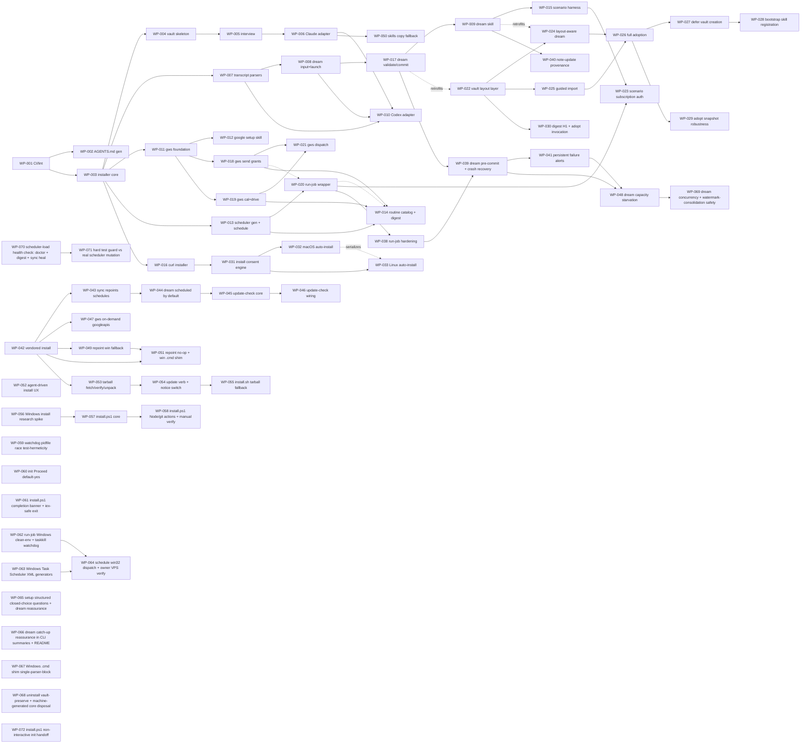

# Roadmap — milestones and work packages

Milestone acceptance criteria are binding; WPs are the unit of implementation. Status source of truth is each spec's frontmatter; this table is the index.

## Milestones

| M | Name | Acceptance (summary) |
|---|---|---|
| M0 | Foundation | Docs, ADRs, spec system, agents, dogfood scaffold exist (this commit). |
| M1 | Skeleton & installer | Clean-machine `npx wienerdog` creates `~/.wienerdog` + vault (git-initialized), detects harnesses; `uninstall --dry-run` lists exactly what was created; `doctor` passes. |
| M2 | Claude adapter + interview | `/wienerdog-setup` produces `06-Identity/*`; CLAUDE.md managed block rendered; new session demonstrably knows the user via injected digest; `sync` idempotent. *Go-public possible.* |
| M3 | Capture + dreaming | Fixture transcripts incl. planted injection → gated notes with provenance; injection never reaches Tier 3; one git commit per run; readable dream report; `git revert` cleanly undoes a run. |
| M4 | Codex adapter | Codex-only machine (no hooks) gets full setup + working dream from rollout files alone. |
| M5 | Google Workspace | Guided OAuth completes; gmail/cal/drive read+draft work headlessly from `claude -p`; sends execute only under a grant, ungranted sends degrade to draft+notice (ADR-0007); tokens 0600, survive reboot. |
| M6 | Scheduler + routine catalog | Native schedule entries on each OS; simulated hang → watchdog kill + alert; job missed by shutdown (dream included) runs within an hour of the machine being back; catalog flow (ADR-0008) configures digest incl. its send-to-self grant; digest arrives by email. |
| M7 | Hardening & release | Threat model finalized vs implementation; install→use→uninstall leaves only the vault; fresh-machine install from README alone; npm publish. |

## Work packages

| WP | Title | Milestone | Model | Status | Depends on |
|---|---|---|---|---|---|
| [WP-001](done/WP-001-ci-and-lint-pipeline.md) | CI and lint pipeline | M0/M1 | sonnet | Done | — |
| [WP-002](done/WP-002-agents-md-generator-and-schemas.md) | AGENTS.md generator + frontmatter schemas | M0/M1 | sonnet | Done | WP-001 |
| [WP-003](done/WP-003-installer-core.md) | Installer core (init/doctor/uninstall, manifest) | M1 | opus | Done | WP-001 |
| [WP-004](done/WP-004-vault-skeleton.md) | Vault skeleton generator + golden tests | M1 | sonnet | Done | WP-003 |
| [WP-005](done/WP-005-interview-skill-and-renderer.md) | Interview skill + identity→managed-block renderer | M2 | opus | Done | WP-004 |
| [WP-006](done/WP-006-claude-adapter.md) | Claude Code adapter (managed block, hooks, skills registration) | M2 | opus | Done | WP-005 |
| [WP-007](done/WP-007-transcript-parsers.md) | Transcript parsers (Claude JSONL + Codex rollout) | M3 | sonnet | Done | WP-003 |
| [WP-008](done/WP-008-dream-orchestrator.md) | Dream input assembly + brain launch (config, lock, watermarks, scratch, invocation) | M3 | opus | Done | WP-007 |
| [WP-009](done/WP-009-dream-skill.md) | Dream skill (phases, tiered gates, provenance) | M3 | opus | Done | WP-008, WP-017 |
| [WP-010](done/WP-010-codex-adapter.md) | Codex CLI adapter (AGENTS.md block, hooks.json, skills discovery, codex-exec brain) | M4 | sonnet | Done | WP-006, WP-007, WP-008 |
| [WP-011](done/WP-011-gws-foundation.md) | gws foundation (OAuth, client seam, Gmail read/draft) | M5 | opus | Done | WP-003 |
| [WP-012](done/WP-012-google-setup-skill.md) | Google setup skill (guided OAuth) | M5 | sonnet | Done | WP-011 |
| [WP-013](done/WP-013-scheduler-generators.md) | Scheduler generators + schedule command (launchd/systemd, reversible) | M6 | opus | Done | WP-003 |
| [WP-014](done/WP-014-routine-catalog.md) | Routine catalog skill + daily-digest/inbox-triage/weekly-review | M6 | sonnet | Done | WP-013, WP-018, WP-019 |
| [WP-015](done/WP-015-scenario-harness.md) | Scenario-test harness (nightly, incl. injection fixture) | M3/M7 | sonnet | Done | WP-009 |
| [WP-016](done/WP-016-curl-installer-script.md) | curl installer bootstrapper (install.sh) | M1 | sonnet | Done | WP-003 |
| [WP-017](done/WP-017-dream-validate-commit.md) | Dream runtime pipeline (watchdog run, diff validation, single commit) | M3 | opus | Done | WP-008 |
| [WP-018](done/WP-018-gws-send-grants.md) | gws send grants, Gmail send, _alert (ADR-0007) | M5 | opus | Done | WP-011 |
| [WP-019](done/WP-019-gws-cal-drive.md) | gws Calendar + Drive read verbs | M5 | sonnet | Done | WP-011 |
| [WP-020](done/WP-020-run-job-wrapper.md) | run-job wrapper (clean env, TCC-guard, watchdog, fail-loud, catch-up) | M6 | opus | Done | WP-013, WP-018 |
| [WP-021](done/WP-021-gws-dispatch-reconciliation.md) | Reconcile gws dispatch with verb-module contracts | M5 | sonnet | Done | WP-018, WP-019 |
| [WP-023](done/WP-023-scenario-subscription-auth.md) | Scenario harness on subscription auth (decouple fixture isolation from auth) | M3/M7 | sonnet | Done | WP-015, WP-020 |
| [WP-022](done/WP-022-vault-layout-layer.md) | Vault layout config layer + layout-aware digest render | M3 | opus | Done | — |
| [WP-024](done/WP-024-layout-aware-dream.md) | Layout-aware dream write path (validate tiers, brain prompt, skill) | M3 | opus | Done | WP-022 |
| [WP-025](done/WP-025-guided-import.md) | Guided import from an existing vault (setup skill step 3) | M2 | sonnet | Done | WP-022 |
| [WP-026](done/WP-026-full-adoption-flow.md) | Full vault adoption — `wienerdog adopt` CLI, prerequisites, layout mapping | M2/M3 | opus | Done | WP-024, WP-025 |
| [WP-027](done/WP-027-defer-vault-creation.md) | Defer vault creation until the vault path is chosen (init `--fresh-vault`) | M2/M3 | opus | Done | WP-026 |
| [WP-028](done/WP-028-bootstrap-skill-registration.md) | Register skills + hooks on bootstrap (sync vault-independent; init runs sync) | M2 | opus | Done | WP-027 |
| [WP-029](done/WP-029-adopt-snapshot-robustness.md) | Harden `adopt` initial-snapshot (surfaced git errors, stale-lock recovery, starter .gitignore) | M2/M3 | opus | Done | WP-026 |
| [WP-030](done/WP-030-digest-h1-and-adopt-invocation.md) | Digest: drop note's leading H1; setup skill shows both adopt invocation forms | M2/M3 | sonnet | Done | WP-022 |
| [WP-031](done/WP-031-install-consent-engine.md) | install.sh dependency-consent engine (detection, tty gate, sudo probe, consent harness) | M1/M7 | opus | Done | WP-016 |
| [WP-032](done/WP-032-macos-autoinstall-actions.md) | macOS consented auto-install (CLT git; official .pkg / brew Node) | M1/M7 | opus | Done | WP-031 |
| [WP-033](done/WP-033-linux-autoinstall-actions.md) | Linux consented auto-install (PM install + ≥18 verify; NodeSource fallback) | M1/M7 | opus | Done | WP-031, WP-032 |
| [WP-034](done/WP-034-tty-prompts-for-cli.md) | /dev/tty prompts for piped CLI confirmations | M7 | sonnet | Done | WP-031 |
| [WP-035](done/WP-035-ci-linux-test-portability.md) | Linux CI test portability (usr-merge, git identity) | M7 | sonnet | Done | WP-033 |
| [WP-036](done/WP-036-linux-resolve-bin-hermeticity.md) | Hermetic resolve_bin isolation (Linux CI) | M7 | opus | Done | WP-035 |
| [WP-037](done/WP-037-macos-runner-hermeticity.md) | Hermetic resolve_bin isolation (macOS CI) | M7 | opus | Done | WP-036 |
| [WP-038](done/WP-038-runjob-production-hardening.md) | run-job hardening: clean-env PATH/USER, evidence-preserving log rotation, brain stderr tail | M7 | opus | Done | WP-020 |
| [WP-039](done/WP-039-dream-precommit-crash-recovery.md) | Dream pre-commit of session edits + crashed-brain vault recovery | M7 | opus | Done | WP-017, WP-038 |
| [WP-040](done/WP-040-dream-note-update-provenance.md) | Dream skill preserves provenance when updating an existing note | M7 | sonnet | Done | WP-009 |
| [WP-041](done/WP-041-persistent-failure-alerts.md) | Persistent failure alerts (alerts.jsonl) rendered into the digest | M7 | opus | Done | WP-039 |
| [WP-042](done/WP-042-vendored-install.md) | Vendor the package into the core; schedules target a stable app/current entry | M7 | opus | Done | — |
| [WP-043](done/WP-043-sync-repoints-schedules.md) | sync repoints existing schedules to the vendored entry (migration) | M7 | opus | Done | WP-042 |
| [WP-044](done/WP-044-dream-scheduled-by-default.md) | Schedule the nightly dream by default when a vault is created | M7 | opus | Done | WP-043 |
| [WP-045](done/WP-045-update-check-core.md) | Update-availability check — core module + config opt-out | M7 | sonnet | Done | WP-044 |
| [WP-046](done/WP-046-update-check-wiring.md) | Wire the update check into run-job + render in digest/doctor; threat model | M7 | opus | Done | WP-045 |
| [WP-047](done/WP-047-gws-ondemand-googleapis.md) | On-demand googleapis in a core deps dir; gws require-seam + clean setup error | M7 | opus | Done | WP-042 |
| [WP-048](done/WP-048-dream-input-capacity-starvation.md) | Fix dream input-capacity starvation (truncate-to-fit + loud capacity alert) | M7 | opus | Done | WP-039, WP-041 |
| [WP-049](done/WP-049-repoint-current-windows-fallback.md) | Windows-safe repointCurrent fallback + orphan current.tmp.* cleanup | M7 | sonnet | Done | WP-042 |
| [WP-050](done/WP-050-skills-copy-fallback.md) | Skills copy-fallback where symlink creation is unpermitted (Windows) | M7 | opus | Done | WP-006 |
| [WP-051](done/WP-051-repoint-noop-and-windows-cmd-shim.md) | repointCurrent same-target no-op + Windows-usable .cmd shim | M7 | sonnet | Done | WP-042, WP-049 |
| [WP-052](done/WP-052-agent-driven-install-ux.md) | Agent-driven install UX — plan-then-install prompt, package trust, restart note | M1/M7 | sonnet | Done | — |
| [WP-053](done/WP-053-tarball-fetch-verify-unpack.md) | Registry-tarball fetch, sha512 verify, unpack into vendored layout | M7 | opus | Done | — |
| [WP-054](done/WP-054-update-verb-and-notice-switch.md) | `wienerdog update` verb + npx-aware update-notice command switch | M7 | opus | Done | WP-053 |
| [WP-055](done/WP-055-install-sh-tarball-fallback.md) | install.sh npm-less tarball fallback (consented curl+verify+tar → node init) | M1/M7 | opus | Done | WP-054 |
| [WP-056](done/WP-056-windows-install-research-spike.md) | Windows install.ps1 platform research spike (consent surface, Node elevation, CI) | M7 | opus | Done | — |
| [WP-057](done/WP-057-install-ps1-core.md) | install.ps1 core — detection, consent, npm-less tarball fallback, CI lint+Pester gate | M7 | opus | Done | WP-056 |
| [WP-058](done/WP-058-install-ps1-node-git-actions.md) | install.ps1 Node/git auto-install (winget → signed MSI + UAC), PATH refresh, manual Windows verification | M7 | opus | Done | WP-057 |
| [WP-059](done/WP-059-watchdog-pidfile-race.md) | Close the watchdog-test pidfile race (bounded poll before asserting the kill) | M7 | sonnet | Done | — |
| [WP-060](done/WP-060-init-proceed-default-yes.md) | init "Proceed?" defaults to yes (per-call defaultYes in shared confirm) | M7 | sonnet | Done | — |
| [WP-061](done/WP-061-install-ps1-completion-banner.md) | install.ps1 stays open with a completion banner (iex-safe return-not-exit) | M7 | opus | Done | — |
| [WP-062](done/WP-062-runjob-windows-clean-env-and-watchdog.md) | run-job Windows reliability — win32 clean env + taskkill watchdog kill-tree | M6 | opus | Done | — |
| [WP-063](done/WP-063-windows-task-scheduler-generators.md) | Windows Task Scheduler XML generators (pure renderers + helpers) | M6 | opus | Done | — |
| [WP-064](done/WP-064-schedule-win32-dispatch-and-manual-verify.md) | schedule.js win32 dispatch — register dream + catch-up via schtasks; owner VPS verify | M6 | opus | Done | WP-062, WP-063 |
| [WP-065](done/WP-065-setup-structured-questions.md) | Structured closed-choice interview questions + dream reassurance in setup skill | M7 | sonnet | Done | — |
| [WP-066](done/WP-066-dream-schedule-catchup-reassurance.md) | Dream catch-up reassurance across CLI summaries + README | M7 | sonnet | Done | — |
| [WP-067](done/WP-067-cmd-shim-single-parser-block.md) | Windows .cmd shim single-parser-block (survive self-deletion on uninstall) | M7 | sonnet | Done | — |
| [WP-068](done/WP-068-uninstall-vault-preserve-and-core-disposal.md) | Uninstall vault-preserve handler + machine-generated core disposal | M7 | opus | Done | — |
| [WP-069](done/WP-069-dream-concurrency-watermark-safety.md) | Dream concurrency + watermark-consolidation safety (lock-first scratch, no-op loser, consumed-only watermark) | M7 | opus | Done | WP-048 |
| [WP-070](done/WP-070-scheduler-load-health-check.md) | Scheduler-load health check — doctor + digest surface "configured but not loaded"; sync heals | M7 | opus | Done | — |
| [WP-071](done/WP-071-test-guard-real-scheduler.md) | Hard test guard against real scheduler mutation (per-user-global labels) | M7 | opus | Done | WP-070 |
| [WP-072](WP-072-install-ps1-noninteractive-init-handoff.md) | install.ps1 hands off to init non-interactively (fix Windows irm\|iex hang) | M7 | opus | Ready | — |

> **First-production-night incident (2026-07-04).** WP-038, WP-039 and WP-041 form
> a serial chain (they edit the shared `run-job.js` / `dream.js` / `validate.js`
> cluster); WP-040 branches off the dream skill independently. Together they close
> the six gaps the first scheduled dream exposed: clean-env PATH/USER (WP-038),
> log-rotation evidence loss (WP-038), brain-stderr surfacing (WP-038 captures +
> WP-039 surfaces), dirty-vault starvation and crashed-brain self-starvation
> (WP-039), transient failure visibility (WP-041), and note-update provenance loss
> (WP-040).

<!-- -->

> **Vendored-install + default-dream + update-check chain (2026-07-04).** WP-042→046
> form a serial chain implementing three owner decisions (ADR-0013/0014/0015).
> WP-042 vendors the package into `~/.wienerdog/app/<version>/` behind a stable
> `app/current` symlink so scheduler entries stop pointing at the ephemeral npx
> cache, AND writes a `~/.local/bin/wienerdog` shim (bare `wienerdog` resolved
> nowhere on real installs — a pre-existing P1 that broke every gws routine).
> WP-043 migrates the two live installs' existing schedules onto that stable path
> (via `sync`, the canonical update command). WP-044 then schedules
> the nightly dream by default the moment a vault is created (silent, 03:30),
> which also seeds the update-check cache each night. WP-045 builds the bounded,
> opt-out, semver-validated update-check module; WP-046 wires its refresh into
> `run-job` and renders the cached notice into the digest + `doctor`, and adds
> THREAT-MODEL T7 plus the deferred `alerts.jsonl` injection-surface note. The
> chain is linear because these WPs share `sync.js`, `schedule.js`, `init.js`,
> `run-job.js`, and `digest.js`; serializing them avoids merge conflicts and lets
> each build on the prior contract. **WP-047** branches off WP-042 (it needs the
> vendored `app/` dir + shim): it installs `googleapis` on demand — with consent,
> once — into `~/.wienerdog/app/deps/` and routes the gws require through a deps-dir
> seam with a plain "run /wienerdog-google-setup" error, so gws works from the
> node_modules-free vendored copy. It shares no files with WP-043→046 and can land
> in parallel after WP-042.

<!-- -->

> **Second silent-starvation incident (2026-07-05).** The 03:30 dream reported
> "nothing new to dream" (exit 0) while four fresh Claude sessions existed past
> the watermark: each extract alone exceeded the 400 000-byte input budget, the
> newest-first size loop `break`s at the first over-budget session (dropping the
> smaller ones behind it), and `entries.length === 0` masqueraded as success — so
> no watermark advanced, no report was written, and the WP-041 durable-alert path
> (which only fires on a *failing* dream) stayed unreachable. Heavy Claude days
> starved the dream permanently and invisibly. **WP-048** closes it: raise the
> default `dream_max_input_bytes` to 8 000 000; replace the break loop with
> water-filling that **truncates boundary sessions to fit** (keep newest messages,
> per-session floor 32 768 B) instead of dropping them whole — guaranteeing the
> newest session is always fed and the watermark always advances; and make a
> wedged (nothing-fed) dream **throw** rather than report "nothing new", so
> `run-job`'s fail-loud records a durable `alerts.jsonl` entry the digest surfaces.
> Extends ADR-0012 (parts 4–5).

<!-- -->

> **Windows degraded-install defects (2026-07-05).** A high-quality external
> report (Windows Server 2022, Node 24, published v0.3.0) surfaced two hard gaps
> in an unconditional code path: (1) `wienerdog sync`/`init` crash with `EPERM`
> in `repointCurrent` because `fs.renameSync` over an **existing** directory
> symlink is not permitted on Win32 — the POSIX-atomic-rename assumption ADR-0013
> made — so every run after the first aborts before writing the digest and
> orphans a `current.tmp.<pid>` link; and (2) skills are never linked into
> `~/.claude/skills/` (symlink creation unpermitted), so the `/wienerdog-*`
> commands never register. Windows scheduling/`install.ps1` stay deferred to
> M6–M7, but a published crash is a defect regardless of support tier. **WP-049**
> (independent, `src/core/vendor.js`) adds a remove-then-rename fallback on
> `EPERM`/`EEXIST`/`ENOTEMPTY` plus an orphan-tmp sweep (brief non-atomic window
> accepted under the module's single-writer assumption; recorded as a dated
> ADR-0013 amendment). **WP-050** (independent, `src/adapters/shared.js` +
> `src/core/manifest.js`) copies each `wienerdog-*` skill folder where symlinks
> are unpermitted, behind a new reversible `copied-skill` manifest kind. Both are
> testable on POSIX via injected `rename`/`symlink` seams (no `process.platform`
> mocking) and can land in parallel — they share no files with each other or with
> WP-048.

<!-- -->

> **Windows agent-driven-install follow-ups (2026-07-05).** After WP-049/050 fixed
> the two headline Windows crashes, the same from-scratch report (Windows Server
> 2022, Claude Code driving `npx wienerdog@latest init`) surfaced three further
> items. **WP-051** (independent of WP-050, on `src/core/vendor.js`) closes two
> defects on unconditional code paths: (1) `repointCurrent` rewrote the `current`
> symlink on *every* sync even when it already pointed at the target — needlessly
> exercising the WP-049 remove-then-rename fallback, which can self-lock on
> Windows because the invoking `node` runs from inside `app/current` and holds the
> reparse point; it now no-ops when `current` is already correct (path.resolve
> compare) while still sweeping orphans; and (2) the bash `~/.local/bin/wienerdog`
> shim is unusable by cmd.exe/PowerShell, so `writeShim` now additionally writes a
> `wienerdog.cmd` on win32 (manifest-tracked `kind:'file'`, byte-idempotent, CRLF).
> Both are POSIX-testable via the existing `opts.rename` seam and a new
> `opts.platform` seam — no `process.platform` mocking. **WP-052** (docs/skill
> only, independent) fixes the agent-driven install *instructions*: the README
> paste-in prompt now tells the driving AI to show the plan (`init --dry-run`)
> before installing (`init --yes`) — the human-in-chat is the consent surface —
> hands it the repo + npm URLs so a cautious agent can verify the package, and
> tells the user to restart the harness so the `/wienerdog-*` commands load;
> `init`'s own prompting is unchanged. The two WPs share no files and can land in
> parallel.

<!-- -->

> **0.4.0 npm-less distribution chain (2026-07-05).** Live 0.3.x testing found
> users with Node ≥ 18 but no `npx`/`npm`. Since Wienerdog has zero runtime deps,
> the published npm tarball IS the whole app, and ADR-0013's vendored layout
> (`~/.wienerdog/app/<version>/` behind `app/current`) is literally "unpack a
> tarball here." **ADR-0016** adds an npm-independent install/update channel that
> fetches the registry tarball over HTTPS, verifies its **sha512** SRI integrity
> before unpacking, and lands it in the vendored layout; npm/npx stays the happy
> path where present. **WP-053** builds the reusable core module
> (`src/core/tarball.js`: fetch `/wienerdog/latest` manifest → validate → download
> → verify sha512 → `tar --strip-components=1` into `app/<v>/`, atomic staging,
> idempotent, no manifest write — the `vendored-tree` entry already covers it).
> **WP-054** adds the `wienerdog update` CLI verb (fetch+verify+unpack, then hand
> off to the **new version's** `sync` so it re-vendors + repoints `current` — never
> the in-process/old sync, or the update silently reverts) and switches ADR-0015's
> "update available" notice to quote `wienerdog update` when `npx` is absent and
> `npx wienerdog@latest sync` when present (pure spawn-free PATH scan at render
> time). **WP-055** gives `install.sh` a consented tarball fallback (ADR-0011
> posture: show what/where, `/dev/tty` prompt, fail-to-print) when Node is present
> but `npx` is not: `curl` the tarball, verify sha512 with the guaranteed-present
> `node`, `tar` into `app/<v>/`, `exec node .../init` (extract-into-final-dir means
> `vendorSelf` sees the version dir exists and skips the copy — no double copy).
> Serial chain (shared ADR + ROADMAP rows; avoids merge conflicts). No auto-update
> invariant (ADR-0004/0015) unchanged: `update` runs only on explicit command; the
> notice only tells. `googleapis` stays npm-only (ADR-0016 §6 — documented, a
> wd-docs follow-up on the google-setup message; no npm-less googleapis path).
> `install.ps1`/Windows bootstrap remains out of scope.

<!-- -->

> **Windows bootstrap `install.ps1` chain (2026-07-05, ADR-0017).** Pulls the
> promised PowerShell installer (ADR-0006) forward from M6–M7: `irm <url>/install.ps1
> | iex` gets a bare Windows Server 2022 / Windows 11 machine to a working
> `wienerdog init` + skills under `install.sh`'s ADR-0011 trust posture.
> **WP-056** is a wd-researcher spike (memo
> `memory/research/2026-07-05-windows-install-ps1.md`) that resolved the two
> load-bearing unknowns rather than guess them: (a) `irm|iex` is PowerShell's
> *object* pipeline, so the interactive console stays usable for per-hop
> `Read-Host` consent — no bash-style `curl|bash` stdin trap; and (b) **Node's
> official MSI is `ALLUSERS=1` per-machine-only and hard-requires UAC — there is no
> non-elevated official Node install**, the decisive elevation fork. It also
> confirmed `ubuntu-latest`/`macos-latest` runners ship `pwsh`+Pester+PSScriptAnalyzer,
> so the PowerShell script is CI-lintable and pure-function-testable with zero extra
> runner cost. **WP-057** (Ready) builds the testable core — the `$NonInteractive`
> detector, `Read-Host` `Confirm-Step` consent, the npm-less registry-tarball
> fallback (ADR-0016 analog of WP-055, with a fully-anchored semver gate), the `npx`
> handoff, PSScriptAnalyzer settings + Pester harness + CI wiring — a complete,
> CI-verified installer for **Node-present** Windows machines; its `Main` prints and
> exits when Node is missing (placeholder). **WP-058** (In-Review) fills that branch
> with the consented Node/git auto-install: winget-if-present, else the official signed
> MSI downloaded + SHA256-verified + installed via a UAC elevation (`Start-Process
> -Verb RunAs`), plus registry PATH refresh — and carries the **mandatory manual
> Windows VM checklist** (CI has no Windows runner). Its elevation posture is confirmed
> (ADR-0017 Accepted, 2026-07-05); CI covers the pure helpers plus the
> SHA-mismatch/elevation-failure *handling* via mocked seams, with the real
> UAC/MSI/registry paths on the manual checklist. Windows scheduling / `schtasks` stays deferred; the dream
> is not scheduled on Windows yet (digest/skills/manual dream still work).

<!-- -->

> **Windows-VPS post-install UX (2026-07-06).** The owner's real Windows Server
> 2022 `irm .../install.ps1 | iex` install worked end-to-end (Node MSI, UAC accept,
> PATH refresh, handoff to `npx wienerdog@latest init`) and surfaced two
> post-install UX asks. **WP-060** (JS, independent) flips `init`'s
> plan-confirmation to default-yes: the shared `confirm()` in `src/core/prompt.js`
> gains a **per-call** `{defaultYes}` opt (default false — every existing caller,
> incl. `uninstall`'s destructive `Proceed with removal?`, byte-for-byte
> unchanged), and ONLY `init`'s "Proceed?" passes `{defaultYes:true}` + `[Y/n]`.
> The default-yes is scoped to the interactive empty-Enter case only: EOF /
> no-terminal (mode 3) still abort loudly, and `--yes` still bypasses — aligning
> init with ADR-0011's `[Y/n]`-default-yes install-hop norm. `adopt`'s four prompts
> are untouched: it uses its OWN local `confirm`, not `src/core/prompt`. **WP-061**
> (PowerShell, independent) makes `install.ps1` survive `iex`: under `irm|iex` the
> script runs inside the user's live host, so `Main`'s `exit` closed the window the
> instant the install succeeded. `Main` now **returns** an exit code (never
> `exit`), prints a plain completion banner on success, and the dot-source guard
> `exit`s only for a real script file (`InvocationName` non-empty) while setting
> `$global:LASTEXITCODE` + returning under `iex` (`''`). Frozen as an ADR-0017
> amendment (iex-safe exit discipline); the no-exit/banner logic is CI-covered by
> Pester `Main` tests (a returning `Main` proves it did not `exit`). The two WPs
> share no files and carry no dependency — they can land in parallel.

<!-- -->

> **Windows scheduled dreaming chain (2026-07-06, ADR-0018).** Closes the last
> platform gap: a Windows install now auto-schedules the nightly dream at 03:30
> at vault creation (ADR-0014, which had carved Windows out as "unsupported"),
> with laptop-off / logged-off catch-up, watchdog/fail-loud, `schedule`
> add/remove/list parity, manifest-tracked reversibility, IRON RULE intact
> (OS-native Task Scheduler tasks, no daemon). The research spike
> (`memory/research/2026-07-06-windows-scheduled-dreaming.md`) resolved the
> load-bearing facts from primary sources: a standard user registers a per-user
> task with **no elevation** via `schtasks /create … /it` at the default
> `/rl LIMITED`; **`StartWhenAvailable` is XML-only**, so registration uses
> `schtasks /create /tn <name> /xml <file> /f` (an XML *renderer*, the
> launchd/systemd analog); an interactive per-user task does not run while logged
> off, so an **ONLOGON + hourly catch-up task** is required exactly as on macOS;
> `paths.js` is **already Windows-safe** (`env.HOME || os.homedir()`) so the
> feared HOME-fix WP does not exist; and the watchdog's negative-PID
> process-group kill is **POSIX-only** (Windows needs `taskkill /T /F`). Two
> Task-Scheduler XML settings default to `true` and would silently skip/kill the
> dream on an unplugged laptop — the generator forces
> `DisallowStartIfOnBatteries`/`StopIfGoingOnBatteries` to `false`. **WP-062**
> (independent, `run-job.js`) adds the two reliability-critical win32 branches —
> Windows-shaped clean env (`;`-PATH + `USERPROFILE`/`APPDATA`/… so the dream
> brain is findable + credential-bearing) and `taskkill /T /F` tree-kill — the
> Windows twin of the launchd USER/PATH incident; both testable on POSIX via an
> injected `platform` + kill/spawn seams (never `process.platform` mocking).
> **WP-063** (independent, `generators.js`) adds the pure XML renderers
> (`windowsDreamTaskXml`, `windowsCatchupTaskXml`) + name/path/escape helpers,
> fully golden-testable in CI. **WP-064** (the capstone, `schedule.js`, depends
> on both) adds the `registerPlatform` win32 branch (write XML via `ensureEntry`,
> register via the injected loader, `WIENERDOG_LOADER_NOOP` honored), the Windows
> catch-up ensure, the `remove()` basename, and a `platform` test seam so the
> whole dispatch is CI-covered on POSIX — plus a **mandatory owner Windows-VPS
> checklist** (no Windows CI runner; the physical UAC-free registration,
> missed-run catch-up, live dream, and uninstall cleanliness gate merge, WP-058
> precedent). `manifest.js` needs no change (reversal is already generic);
> `init`/`adopt` already reach `ensureDreamSchedule`, which stops degrading
> Windows once the branch exists. Serial only where they share files: WP-062 and
> WP-063 land in parallel; WP-064 after both.

<!-- -->

> **Post-setup UX polish (2026-07-06, two parallel S WPs).** A full
> `/wienerdog-setup` on Windows produced two platform-agnostic UX asks. **WP-065**
> (setup skill only) makes the interview's closed-choice items — the Step 0
> adjust-menu, preferred tone, the fresh/import/adopt vault choice, and memory
> eagerness — ask via a **structured multiple-choice question where the harness
> provides one** (Claude Code's `AskUserQuestion`) and via a plain **numbered
> list where it does not** (Codex CLI), with the binding invariant that the user
> can always type a custom answer (Claude Code's `AskUserQuestion` supplies the
> free-text "Other" automatically). Genuinely open items (role, projects, tools,
> goals, standing rules) stay free-text — exactly four `(closed-choice)` markers,
> no over-structuring. **WP-066** adds a frozen one-sentence **dream catch-up
> reassurance** to every surface that discloses the 03:30 schedule — `init.js`
> and `adopt.js` summaries and the README Dreaming bullet — so users never think
> they must leave the machine on overnight; it *extends* ADR-0014's plain
> disclosure (the 03:30 time still stated), it does not weaken it. The two WPs
> share **no files** (WP-065 owns `skills/wienerdog-setup/SKILL.md` outright,
> including that skill's copy of the reassurance, so the CLI/README changes in
> WP-066 never collide with it) and carry no dependency — they land in parallel.
> Neither needs a new ADR: the reassurance surfaces a behavior ADR-0014 already
> guarantees (WP-020 catch-up), and vendor-neutral graceful degradation is a
> local skill-authoring choice.

<!-- -->

> **Windows uninstall field report (2026-07-06, credit: real Windows Server 2022
> v0.6.0 uninstall via the `wienerdog.cmd` shim).** The vault-preservation itself
> is by design (M7: "install → use → uninstall leaves only the vault") and is
> never weakened here — but three mechanics around it were genuinely broken. Two
> parallel WPs, **no shared files**, no dependency. **WP-067** (S, `src/core/vendor.js`)
> fixes the `.cmd` shim: a successful `uninstall` invoked *through* `wienerdog.cmd`
> deleted that shim mid-run, so when the node child returned cmd.exe re-opened the
> (now-gone) batch file → `The batch file cannot be found.` + exit 1. The launcher
> becomes a single-parser-block line `@node "<current bin>" %* & exit /b` that cmd
> reads into memory before node runs and terminates from memory, so it survives
> self-deletion and propagates node's exit code (supersedes WP-051's `.cmd`
> template; WP-051's done-spec untouched). **WP-068** (M, `src/core/manifest.js` +
> `src/cli/uninstall.js`, ADR-0019) fixes uninstall: (a) `vault-file`/`vault-dir`
> manifest kinds get an explicit *preserve* handler so the 13 seeded vault files
> stop surfacing as "skipping unknown manifest entry kind" errors and instead
> produce ONE plain-language line (*"Your memory vault at <path> was left
> untouched (N files) — your notes are yours."*); and (b) the core's
> machine-generated-mechanics subdirs — `state/`, `logs/`, `schedules/`,
> `secrets/` (all Wienerdog-authored, none manifest-tracked; the report's premise
> that `secrets/` was "already manifest-handled" was **wrong** — verified: zero
> `manifestLib.record` in `src/gws/`) — are recursively disposed after the
> manifest replay, then the now-empty core is removed, so `~/.wienerdog` is truly
> gone (the sole exception is a deliberately-kept user-modified `config.yaml`).
> ADR-0019 records the invariant (the core holds only disposable mechanics; the
> vault is always outside it) and the security decision to remove OAuth tokens on
> uninstall. A full install → sync → uninstall e2e asserts the vault tree is
> byte-identical before/after (the treasure invariant).

<!-- -->

> **Third silent-loss incident — overlapping dreams (2026-07-07, credit: real
> production dogfooding).** A catch-up dream (A) held the lock with 5 live extracts
> in the shared `state/dream-scratch` and its brain mid-read; the hourly catch-up
> fired again (B) ~26 s later (the daily run had not yet written `last_success`).
> B's `collectExtracts` ran **before** it tried the lock and rebuilt the shared
> scratch dir (`rm -rf` + `mkdir`), destroying A's inputs; B then failed to acquire
> A's lock and, on the backoff path, called `cleanScratch` — a second deletion.
> Brain A found its scratch gone, wrote only failure-doc notes, exited 0 — and
> orchestrator A still committed and **advanced its watermark past all 5 extracts,
> 3 of which no dream had ever consolidated** (silent permanent drop — the WP-048
> capacity-starvation outcome via a new cause). Two defects: (1) scratch is shared
> state mutated *before* the lock and deleted by the lock-loser; (2) the watermark
> advances on any successful commit, not on whether the brain actually consumed the
> extracts. **WP-069** (one opus M WP; the fixes interlock in the same `run()`
> flow) closes both: acquire the lock **before** any collect and make the
> lock-loser a **pure no-op** (frozen concurrency invariant — a concurrent dream
> can never touch the holder's inputs); pid-guard the teardown so a legitimately
> superseded (stale-lock-stolen) dream cleans neither the stealer's scratch nor its
> lock; and gate the watermark on `scratchIntact` — every input extract still
> present and byte-identical to its pre-brain baseline when the brain finished —
> so a brain that exited 0 on vanished inputs restores the vault, advances no
> watermark, and fails loud (durable alert), exactly like the WP-039 crash path.
> Keeps the single shared scratch dir + strict lock ordering (per-run scratch
> isolation declined — lock-first already makes the loser never touch scratch).
> Extends ADR-0012 (parts 6–7).

<!-- -->

> **Silent scheduler-unload incident (2026-07-07, ADR-0018 amendment).** The
> launchd **dream and catchup agents were silently UNLOADED** — plists intact on
> disk, but `launchctl` had no record (exit 113 on `launchctl print`) — so 03:30
> fired nothing, no run, **no alert** (fail-loud only triggers on a job that runs
> and fails), discovered only by a missing report. Two owner-approved hardening WPs.
> **WP-070** (opus M, independent) makes the invisible-failure class **visible**:
> `wienerdog doctor` and the injected session digest surface any registered
> `scheduler-entry` (manifest — includes the **catchup** agent, not just `jobs:`)
> whose OS record is missing, via a **read-only** per-OS probe derived from the
> stored `unload` argv (launchd `launchctl print`, systemd `systemctl --user
> is-active <unit>.timer`, Windows `schtasks /query`; exit 0 = loaded). The digest
> mirrors the ADR-0015 **cache-then-render** split (probe in `sync`/`run-job` writes
> `state/scheduler-status.json`; the SessionStart hook only `cat`s the pre-rendered
> digest); `doctor` probes **live** (catches even the all-jobs-unloaded case). A
> missing entry is an actionable WARN, not a fail. The honest remediation is made
> true: `sync` now **heals** (reloads any entry the OS lost — plain re-registration
> previously no-op'd on identical files). doctor/digest never mutate. **WP-071**
> (opus M, depends WP-070) fixes the **root cause**: launchd/systemd/schtasks
> identifiers are **per-user-global, NOT HOME-scoped**, so a scheduler test under a
> temp `HOME` still `bootout`'d the real agent (confirmed: `uninstall.test.js`
> `init --fresh-vault` → `uninstall` unloaded the real dream agent). All real
> scheduler **mutations** route through one `schedulerSpawn` chokepoint; a suite-wide
> guard (`WIENERDOG_TEST_NO_REAL_SCHEDULER`, set by a zero-dep `tests/run.js`) makes
> it **throw loudly** when a test reaches it without a seam — the belt to the
> injected-loader / `WIENERDOG_LOADER_NOOP` suspenders. Depends on WP-070 (which
> makes `doctor.test.js` hermetic and ships the self-guarding probe), so the two
> share no test file. **Follow-up (unblocked, now that WP-069 merged):** wiring the
> identical `schedulerLine` into `dream.js`'s digest render (step 15) is a 1-line
> change deferred out of WP-070; the passive digest surface is `sync`-carried until
> then, and `doctor` (live) is authoritative meanwhile. Amends ADR-0018.

<!-- -->

> **Windows irm|iex init-handoff hang (2026-07-07, credit: owner field report,
> Node-present Windows machine).** `irm .../install.ps1 | iex` printed
> "Found Node v24.18.0 - handing over ..." then **hung forever** — no plan, no
> prompt. Root cause (verified from code): the handoff ran
> `npx --yes wienerdog@latest init`, where `--yes` is **npx's** package-prompt flag
> (it precedes `wienerdog@latest`), NOT passed to `init` — so `init` reached its own
> `[Y/n]` confirm (`init.js:117`) and blocked on stdin. POSIX survives via
> `confirm()`'s `/dev/tty` fallback (WP-034); Windows has no `/dev/tty` and under
> `irm|iex` the init child's stdin is tangled in PowerShell's object pipeline, so
> the plan+prompt never surface and it hangs — the WP-061 iex-handoff fragility
> class. **WP-072** (opus S, independent) makes the handoff **non-interactive**:
> `Main` builds the forwarded argv once as `$ForwardArgs + --yes` (de-duped,
> null-safe) and passes it to BOTH the `npx` branch and the `Install-ViaTarball`
> branch, so init skips its blocking confirm while still PRINTING its full plan
> (transparency intact; the installer one-liner + printed plan are the consent
> surface per ADR-0011/0017/WP-052). The two handoff seams
> (`Start-WienerdogNpx`/`Start-WienerdogInit`) are untouched — the npx `--yes` stays
> where it is; init's `--yes` arrives via `@ForwardArgs`. **POSIX is left
> interactive on purpose** (the `/dev/tty` prompt works and is the designed UX — fix
> only what's broken); WP-060's default-yes cannot save the iex case (tangled stdin
> delivers no line at all). Frozen as an **ADR-0017 amendment (non-interactive init
> handoff)**. CI-covered by Pester `Main` argv assertions on the mocked seams; the
> real no-hang reproduction on the Node-present Windows box is the owner manual gate
> (WP-058/061 precedent). Residual init.js mode-1 readline hang (Windows
> stdin.isTTY-true-but-unreadable) is noted out-of-scope: removed from the installer
> path by `--yes`, and no safe non-heuristic guard exists.

<!-- -->

## Dependency graph

