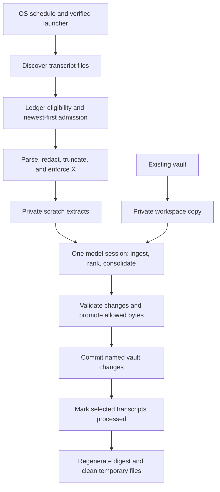
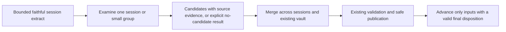

# Dream: end-to-end assessment from product first principles

## Status and purpose

Exploratory assessment, not an approved design, ADR amendment, or implementation
spec. The owner requested a step back to understand the complete dream process
before selecting further fixes. No runtime, configuration, vault, transcript
ledger, scheduler, or upstream change was made for this assessment.

Source baseline: `1c3790de9f88f40aa28202e6f47748500babd555`, the fork's main
after the filtered-input-budget and live-owner-lock changes. Analysis documents
live on a separate branch/worktree because the installed application points at
the main checkout. The previous accepted choices remain in force: X caps the
complete normalized extracts; newest-first; stop on remainder overflow; skip an
individually oversized extract; finish a session started before the soft
preprocessing deadline; no persistent partial-session checkpoint.

**Conclusion:** the latest fix repairs allocation of the preprocessing budget.
It does not establish reliable conversion of conversations into memory. The
largest gaps are input fidelity, explicit accounting for semantic processing,
and separation of per-session understanding from cross-session consolidation.
Preserve the existing safe publication machinery while addressing those gaps.

## 1. Start with the product outcome

The product earns its place when a future session makes a better decision because
of an accurate, relevant memory from earlier work. More notes, more bytes read,
and a successful process exit are intermediate facts, not that outcome.

The minimum useful contract has six parts:

1. **Faithful capture:** distinguish human statements, model statements, tool
   evidence, harness instructions, and copied history. State any information loss.
2. **Accountable examination:** every admitted session has a disposition. Finding
   nothing worth keeping is a valid result; not examining it is a different state.
3. **Grounded learning:** facts and proposed instructions retain their source and
   uncertainty. Copies of one observation do not create independent recurrence.
4. **Safe integration:** merge useful findings with existing knowledge; preserve
   user work and make conflicting or withheld changes visible.
5. **Bounded progress:** respect work, memory, time, model-context, and cost
   constraints without silently declaring unexamined inputs complete.
6. **Useful recall:** relevant knowledge can reach later work without injecting
   the entire vault or converting untrusted material into instructions.

These requirements do not mean remembering everything. Selective memory is the
product. Silent omission before an accountable selection is the defect.

## 2. What actually runs today

The source map below takes precedence over older overview prose. For example,
`docs/ARCHITECTURE.md` still describes scalar watermarks, direct vault writes,
and chunk-and-summarize behavior that do not describe the current pipeline.



| Stage | Current behavior | Owner in source |
|---|---|---|
| Start | The independent launcher verifies authorization; run-job supplies a clean environment and outer watchdog. The dream has its own lock and model watchdog. | `src/scheduler/launcher.js`, `src/cli/run-job.js`, `src/cli/dream.js`, `src/core/dream/lock.js` |
| Discover | Scan Claude project JSONL files one directory deep and Codex rollout files recursively. Transcript files are ground truth; this path does not consume the hook queue as its work list. | `src/core/transcripts/{index,claude,codex}.js` |
| Select | Compare file size/mtime/device/inode with the ledger. Unchanged processed files are skipped; changed ones are selected again in full. A migration baseline and quarantine rules also affect eligibility. | `src/core/dream/ledger.js:selectState` |
| Admit | Filter the 50 MiB source ceiling, sort newest modified first, parse one session at a time, and measure its compact JSON against X. Defaults: X = 8,000,000 bytes and a 60-second soft preprocessing deadline. | `src/core/dream/{scratch,config}.js` |
| Normalize | Map selected roles, redact secrets, keep at most the first 4,000 characters per message and the last 2,000 messages per extract. Oversized lines and unsupported records can be omitted. | `src/core/transcripts/{index,stream,claude,codex}.js` |
| Prepare | Recreate scratch; copy eligible vault content into a private workspace and construct its baseline. The real vault is not the model's write target. | `src/core/dream/{scratch,workspace}.js` |
| Think | Give one Claude model session the scratch directory, workspace, date, and layout. The shipped skill asks it to read every extract, extract candidates, deduplicate, rank, and write notes. There is no code-owned per-session completion result. | `src/core/dream/brain.js:DREAM_PROMPT`, `skills/wienerdog-dream/SKILL.md` |
| Validate | Require the model process group to settle, check scratch integrity and workspace changes, apply publication/secret/skill/Tier-3 gates, and preserve/refuse changes according to existing contracts. | `src/cli/dream.js`, `src/core/dream/{delta,promote,validate,vault-write}.js` |
| Commit | Commit exactly the decided named bytes, retaining user edits and avoiding writes to the user's git index. | `src/cli/dream.js`, ADR-0012 workspace amendment |
| Advance | After publication/commit processing, apply the run-level secret-withholding outcome to every `sel.processed` entry. On a clean run they all become `processed`, without a read-coverage or semantic-completion check. | `src/cli/dream.js:1149`, `src/core/dream/ledger.js:recordProcessed` |
| Reuse | Render approved identity notes, project directory names, and an eligible latest daily summary into a bounded digest. Other notes remain available for later retrieval; saving one does not automatically inject it. | `src/core/digest.js:renderDigest` |

There are three different things often called “useful content” in conversation:
the normalized transcript extract, the model's candidate observations, and the
accepted vault changes. **X currently bounds the first**, including metadata and
boilerplate that survived parsing. Moving X to candidate observations would
change the approved contract and would still require a separate intake bound.

## 3. Evidence from the September 16 run

### Durable operational facts

- Local time: approximately 03:30:04–03:43:54, Europe/Budapest.
- Scheduler state: `last_status: ok`; vault commit `e1729da` records 11 notes,
  zero skills, plus the report/warnings files.
- Code log: 10,338 sessions deferred for capacity; one newly quarantined source
  over the source-size ceiling. This establishes the new collector path ran,
  not the exact number of useful facts it preserved.
- Ledger: 198 files updated to `processed`, one to `quarantined` that night.
- Model-authored report: 192 extracts in its chosen date window, 20 read in full,
  172 classified by working directory/session family. Its per-context table sums
  to nine Codex reads while its prose says eight; this is not authoritative
  accounting.
- The actual local Claude transcript records 27 scratch `Read` calls across 21
  distinct files, nine calls with an explicit offset or limit. It also records
  `Grep` calls. These facts corroborate selective access; they are **not** proof
  that 21 files were fully understood or that other files were never searched.
- The model identified itself in that trace as `claude-opus-5`. No additional
  model execution was performed for this assessment.

The report claims other scratch extracts were leftover material from prior
windows. That explanation conflicts with `collectExtracts`, which removes and
recreates scratch before writing this run's selections. An older `started`
timestamp can belong to an eligible, newly changed or backlogged session. The
model has no basis for treating it as already consumed merely because it is old.

### Read-only reconstruction, with explicit limits

The original scratch has been cleaned. Of the 198 processed source files, 187
still matched their recorded file fingerprint when examined; 11 had changed.
Only those 187 were reparsed. Their metrics are **a reproducible subset, not a
reconstruction of all 198 original extracts**. Fingerprint equality is the
product's metadata-based criterion, not a cryptographic snapshot guarantee.

The unchanged subset contained 12 Claude and 175 Codex sources:

| Observation | Measurement | Interpretation |
|---|---:|---|
| Compact normalized JSON | 4,237,046 bytes | Subset size; do not compare it to X as the full original batch |
| Pretty-printed scratch representation | 4,513,205 bytes | X uses compact bytes, not exact on-disk/model-facing representation |
| Extracts with `truncated: true` | 185 / 187 | “Whole extract admitted” does not mean “whole original conversation retained” |
| Empty extracts | 1 / 187 | Successful parsing/admission alone can consume no conversational evidence |
| Normalized `user` messages | 1,085 | Includes Codex developer/control messages mapped to `user` |
| Capped normalized `user` messages | 587 | Prefix truncation affects the largest input category |
| Codex developer messages | 646 | About 1.65 million characters survive a simple first-4,000-character measurement, before redaction/markers |
| Nonempty Codex tool outputs turned into empty text | 4,146 | A confirmed unsupported input shape, not a model attention problem |
| Codex files with parent metadata | 91 / 175 | A source of family information that the extract does not retain |
| Codex files with fork/history-boundary metadata | 33 / 175 | A source of copied-history information that the extract does not retain |

The 175 Codex files contain 208 `session_meta` records, all naming CLI version
`0.154.0`; counts of metadata records must not be mistaken for counts of files.
The parser's compatibility commentary names `0.144.1`. This observation is
about these local records, not a claim about all releases of Codex.

Aggregate evidence is retained in
[the companion JSON](2026-09-16-dream-process-evidence.json). No private message
content or user-specific source-path inventory is copied into this repo.

## 4. Findings and their consequences

### F1 — Completion accounts for admission, not examination [confirmed]

`scratch.js` calls the selected list `processed` before the model runs. The CLI
later advances every item in that list when the run's secret gate allows it.
The model supplies no machine-checked disposition for each input. The report's
admitted sampling therefore coexists with all selected files being marked done.

This is the central missing contract. The valid outcomes must distinguish
“examined, no useful candidate,” “examined, candidates handled,” “deferred,” and
“blocked.” Merely requiring a note from every session would incentivize junk.
Merely asking the model to list all IDs can produce a formally complete lie.

A completion record can prove that a bounded input was delivered and its output
passed structural checks. It cannot prove understanding. Semantic coverage
still needs evaluation on examples with known important observations.

### F2 — Input normalization loses evidence and blurs authorship [confirmed]

The observed Codex tool result shape is:

```json
{"type":"custom_tool_call_output","output":[{"type":"input_text","text":"sentinel-tool-result"}]}
```

`mapCodexItem` currently returns `{role: "tool_result", text: "", ts: null}`
for that shape. All 4,146 measured instances contain nonempty text. This loses
evidence for outcomes and decisions before any model sees it. Restoring that
content will increase normalized input volume; a lower session count after the
fix need not mean worse coverage.

Separately, developer messages become `role: user`; parent/fork metadata is
dropped; Codex message timestamps are emitted as null. The data model cannot
express distinctions later ranking decisions need. The observed `agent_message`
record type is also ignored; whether its content duplicates other retained
messages needs examination before deciding to include it.

The Claude parser additionally ignores ordinary text blocks in array-valued
user content, while handling tool-result blocks there. That code path deserves
a format-compatibility fixture; its incidence in this run was not measured.

**Repair implication:** processed records contain no extractor-version field.
Fixing the parser will not automatically retry unchanged files already marked
processed. Any parser WP needs a deliberate, bounded replay/migration decision.
Do not reset the live ledger as part of this assessment.

### F3 — The capacity bound is not a model-work contract [confirmed design gap]

X bounds serialized normalized inputs. It does not bound how many model tokens
will be required after tool formatting, workspace reads, outputs, or repeated
context. Neither it nor the 60-second collector allowance guarantees the model
can examine the admitted batch within its own 20-minute timeout.

The 4,000-character and 2,000-message caps also precede X. A long message can lose
its final correction even when the complete batch is well below X. Keeping those
caps is an accepted current resource policy, but presenting its output as complete
semantic processing is misleading. Revisit loss handling, not just the numbers.

We have not measured why this model chose to sample. Context pressure, prompt
interpretation, prior reports, and time/effort tradeoffs are hypotheses. There is
no evidence that raising X, timeout, or model size alone would fix the behavior.

### F4 — A physical file is not an independent learning episode [confirmed gap]

Whole-file selection replays earlier messages when a transcript grows. Forked
agent sessions can repeat their parent's prompts; parallel tasks in one working
directory can also be genuinely distinct. The model is currently asked to infer
these relationships after the parser has thrown away available structural clues.

Neither a matching sentence nor the same `cwd` proves two sessions are one
independent observation. Conversely, different session IDs do not prove three
independent confirmations of a preference. Deduplication, incremental change,
and recurrence are related but different decisions.

Keep whole-session retry as the default while improving identity/provenance;
incremental message checkpoints are an optional later complexity, not a
prerequisite for correcting this.

### F5 — Publication quality checks and learning quality checks differ [confirmed]

The workspace/promotion path provides substantial protection: isolated writes,
baseline comparison, concurrent-edit handling, secret controls, skill ownership,
decided-byte commits, and recovery dispositions. Preserve this work.

Ordinary Tier-3 validation checks frontmatter values for confidence, recurrence,
and trust. It does not independently establish that a claimed general fact is
supported by three independent episodes. Skill learnings have additional
invocation-based checks; do not generalize the ordinary-note limitation to
erase those existing checks. Identity injection also has its separate
human-approved hash check.

The skill's single `confidence` number mixes importance, novelty, actionability,
recurrence, and stability. A useful proposal can still be factually uncertain.
There is no measurement here showing those scores are calibrated probabilities.
Evidence validity and memory usefulness should be judged separately.

### F6 — Reporting and recall do not close the product feedback loop [confirmed / open]

The human report is model-authored; today it can choose its own date cohort and
misdescribe scratch freshness. Code counts capacity exclusions in the log, but
does not reconcile selected, examined, rejected, deferred, and completed IDs in
one durable run record. The existing `WP-dream-report-run-skips` covers a useful
part of intake reporting, not semantic completion; its provisional scope must be
re-derived before dispatch rather than silently expanded here.

The configured `memory_mode: conservative` is not read by the dream config or
passed into its prompt. In `src/`, its other occurrences are installation/adoption
writers and a comment describing the fixed Tier-3 floor. Treat that setting's
advertised effect as a separate confirmed configuration/documentation gap.

Recall is selective by design: the digest is capped at 32 KiB, with per-identity
caps, approved hashes, and a bounded daily-summary path. Most project/resource
notes are not automatically injected. Whether future tasks actually find and
benefit from those notes remains **unmeasured**, not a demonstrated failure.

## 5. Design directions worth comparing

| Direction | Benefit | Cost / limitation |
|---|---|---|
| Smaller single batch, stronger prompt, per-input dispositions | Smallest change; easier to evaluate than the current unbounded choice of what to read | Still combines many responsibilities in one context; self-reported completion needs external evaluation |
| Bounded per-session or small-group ingestion, then cross-session consolidation | Makes input coverage local; consolidator works with compact evidence-bearing candidates rather than all raw conversation text | More model calls, repeated setup cost, and a risk that a local ingest pass drops cross-session signals |
| Durable candidate staging across runs | Can retry consolidation without rereading/rethinking completed sessions; separates ingestion progress from publication progress | New persistent state, retention, versioning, privacy, and recovery contracts; easily overbuilt |

**Recommended direction:** prototype the second, initially with ephemeral
per-run results and whole-session completion. Keep durable candidate staging a
separate decision only if measured replay cost or batch-level recovery warrants
it. Bounded calls can execute sequentially within the existing scheduled job;
this requires no daemon or service and does not imply spawning parallel agents.



Keep X as the existing intake ceiling unless the owner explicitly chooses a
new meaning. Give each model call a separately bounded input/output allowance
that includes its instructions and required vault context. Start no new work
unit after its admission deadline; reserve enough overall time to publish and
clean up. Merely reusing X for every call would leave model cost unbounded.

This respects the refusal to persist partial sessions: a session may be worked
on temporarily in pieces, but it is not durably completed until its full required
work succeeds. A failed incomplete session remains retryable. Whether even
temporary chunking is needed should be established with examples; it is not
assumed as part of the first prototype.

If consolidation fails after ingestion, ephemeral candidates may be discarded
and those sessions retried. If consolidation deliberately retains no candidate,
the input can still be completed. If a candidate is blocked from publication,
completion must follow an explicit outcome policy, including the existing secret
preservation rules. One stage's success cannot silently stand for another's.

## 6. Architecture opportunities, ordered by product value

### 1. Give input fidelity one clear owner

- **Files/modules:** `src/core/transcripts/{index,claude,codex,stream}.js`.
- **Problem:** harness format, truncation, authorship, and lineage are collapsed
  before consumers can distinguish them.
- **Solution:** make normalization's interface state what evidence was retained,
  its origin, and what was omitted. Keep raw harness variation in the parser
  implementation, with fixtures for both harnesses.
- **Benefit:** greater module depth and locality; downstream modules do not need
  to reverse-engineer vendor records or guess session families.

### 2. Give completion accounting one clear owner

- **Files/modules:** `scratch.js`, `brain.js`, `cli/dream.js`, `ledger.js`, and the
  existing promotion results.
- **Problem:** admission produces `processed`; model exit and run-level secret
  results stand in for per-input completion. The ordering is spread across callers.
- **Solution:** a module owns the interface from admitted input to final
  disposition. It hides reconciliation and retry rules behind a small interface;
  the model remains a true external dependency with a test adapter.
- **Benefit:** tests cross the same seam the orchestrator uses: a skipped or
  malformed result stays pending; an explicit no-candidate result can complete.
  Deleting this module would scatter those decisions back across the pipeline,
  so it would earn its depth rather than be a pass-through extraction.

### 3. Separate understanding a session from updating shared memory

- **Files/modules:** `brain.js`, the dream skill, and `cli/dream.js`.
- **Problem:** one model context chooses its own coverage while doing extraction,
  scoring, cross-session reasoning, note editing, skill work, and reporting.
- **Solution:** a bounded ingest interface returns evidence-bearing candidates;
  consolidation owns cross-session reasoning and vault updates. Preserve the
  publication module rather than duplicating it in each ingest worker.
- **Benefit:** failures and evaluation become local. The extra interface and
  model-call cost are justified only if the prototype improves recall/coverage.

These are architectural candidates, not detailed interface designs. No new
plugin system, storage service, or generalized job framework is proposed.

## 7. What to measure before choosing defaults or claiming improvement

The measurements above are enough to establish the baseline defects. They are
not enough to choose a new model batch size or claim better memory quality.
Use a small sanitized evaluation corpus with known expected observations:

| Case | Required check |
|---|---|
| Important correction after character 4,000 | It is retained or the omission is explicit; it is never silently treated as examined |
| Tool result in each supported harness shape | Evidence text and trust origin survive normalization |
| Parent session plus copied subagent history | One source is not counted as independent recurrence; genuinely new subagent evidence remains available |
| Old session updated today | New information is considered regardless of the session's original `started` date |
| Session with nothing durable | It completes without forcing a low-value note |
| Model skips one input or returns malformed output | The omitted input remains retryable and accounting cannot say full completion |
| Failure after some ingest work / during publication | Completed and pending states obey the chosen retry contract; user edits survive |
| Contradiction of an existing memory | Correction is integrated without creating an unsupported universal instruction |
| Later task needing an earlier decision | The accepted memory is found and improves the answer |

Measure input coverage, known-important-fact recall, unsupported-fact rate,
duplicate/independent-source handling, actual tokens and duration per completed
session, retries, and backlog age. Evaluate quality separately from structural
completion. Do not equate “a Read call happened” with “the model understood it.”

Backlog sustainability is a rate question: completed new/changed information must
outpace incoming demand over time for old work to drain. The observed 10,338
deferred files do not establish that rate and are not 10,338 independent useful
conversations. Keep newest-first as accepted; consider an age-reserved allowance
only if measurement shows unacceptable starvation and the owner revisits policy.

## 8. Suggested progression and decision boundary

1. Accept or revise the product contract: explicit examination outcomes, grounded
   candidates, bounded progress, and useful recall.
2. Specify input-fidelity repairs with redacted format fixtures and a targeted
   replay policy for already-processed affected inputs. Do not feed dramatically
   more restored content into the current model batch without revisiting its bound.
3. Specify completion accounting and code-owned reporting, coordinating with the
   existing report WP. This is useful even if the single-call design remains.
4. Compare the smallest single-call baseline with bounded ingestion plus
   consolidation on the same corpus. Only then choose model batch sizes/defaults.
5. Add persistent candidate staging or incremental transcript processing only
   if measured costs justify their state/recovery burden. Evaluate recall next.

Implementation remains the repository's spec-driven workflow: wd-architect
drafts bounded WPs/ADR changes, independent design review and owner sign-off
precede implementation. ADR-0012/0023 completion and resource semantics would
need explicit review; this note does not supersede them. The smaller existing
filtered-budget fix was valid within its accepted scope and remains useful.

## Evidence locations and limitations

- Runtime output: `~/.wienerdog/logs/dream/2026-09-16.log` and
  `2026-09-16T01-30-04-402Z.log`.
- Scheduler/ledger: `~/.wienerdog/state/{schedule,transcript-ledger}.json`.
- Vault report: `~/wienerdog/reports/dreams/2026-09-16.md`; commit `e1729da`.
- Model trace: the 2026-09-16 JSONL under
  `~/.claude/projects/-Users-felho--wienerdog-state-dream-run/`.
- Subset method: enumerate processed ledger records dated 2026-09-16, rediscover
  source files, retain exact `ledger.fingerprint` matches, and call
  `transcripts.parseWithOutcome` with a fresh per-session budget. Aggregate
  only sizes/counts. Inspect raw record *shapes* with the same bounded reader.
- Trace method: count `tool_use` records, scratch `Read` paths, and explicit
  offset/limit arguments; do not infer semantic comprehension from those counts.
- No full original scratch snapshot, exact original-batch token total, full
  factual audit of all 11 notes, model quality benchmark, or prior ledger history
  was available in this assessment. No claim depends on having those artifacts.
- Ordinary scheduled dream succeeded; the existing catch-up integrity refusal
  is a separate operational issue, not an explanation for the model's sampling.

## Lessons

- WP-dream-filtered-input-budget: distinguish raw source, normalized extract,
  candidate observation, and accepted memory when discussing “useful input.”
- WP-dream-filtered-input-budget: successful admission and successful publication
  do not together prove that every admitted input was examined.
- WP-dream-report-run-skips: code-owned coverage counts and model-authored learning
  explanations answer different questions; retain both and reconcile their scope.

## Validation of this assessment

- Markdownlint: zero errors for this document.
- Repository frontmatter validation: passed, 274 specs and four agent files.
- Companion JSON parses; subset totals reconcile with the ledger count.
- Pure calls against the pinned source reproduce the lost array-shaped tool
  output, developer-to-user mapping, and unchanged processed-file suppression.
  The ledger demonstration constructs a synthetic in-memory record; no live
  state is changed.
- No product code or prompt was changed, so the product test suite was not rerun.
  This assessment has not passed an independent design-review gate and makes no
  implementation-readiness claim.
